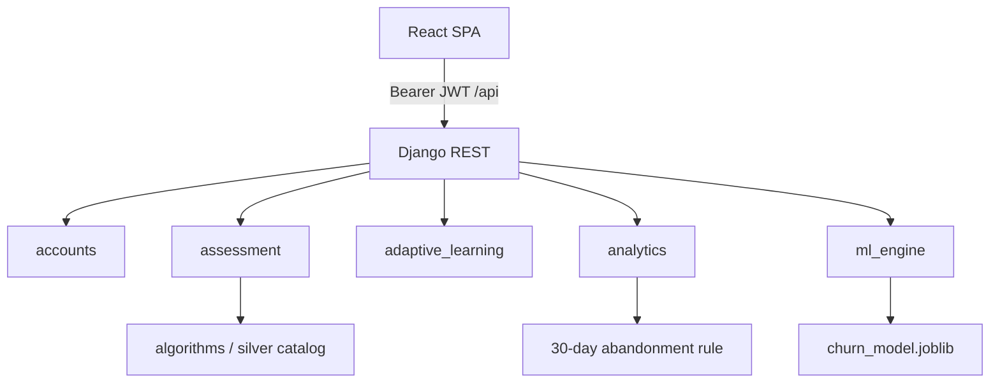

# Architecture

## Overview

Cognitive learning platform for media-literacy / cognitive resilience research.

| Layer | Tech | Path |
|-------|------|------|
| Frontend | React 18 + Vite + Tailwind | `cognitive-frontend/` |
| Backend | Django 5.2 + DRF + SimpleJWT | `coglearning/` |
| Database | PostgreSQL (prod) / SQLite (local fallback) | env-driven |
| Algorithms | Silver Project + in-app catalog bridge | `silver_project/`, `coglearning/algorithms/` |
| Live ML | Churn RandomForest + retention notifications | `coglearning/ml_engine/` |
| Offline ML | Abandonment training pipeline | `scripts/train_abandonment_model.py`, `models/` |

## Roles

| Product name | Code `role` | Primary UI |
|--------------|-------------|------------|
| Citizen | `student` | `/student/*` |
| Domain expert | `teacher` | `/teacher/*` |
| Manager | `admin` | `/manager/*` (+ teacher tools) |

## Request flow

## Django apps

- **accounts** — User, JWT login/refresh/logout(blacklist), register, profile, algorithm preferences
- **assessment** — Cognitive tests, sessions, grading, Silver catalog query params on student list
- **adaptive_learning** — Content, paths, recommendations, teacher CRUD
- **analytics** — Dashboards, engagement metrics, abandonment evaluation
- **ml_engine** — Feature extraction, churn inference, retention notifications

## Frontend structure

- `src/App.jsx` — lazy-loaded role routes + guards
- `src/hooks/` — `useAssessment`, `useAdaptive`, `useAnalytics`, `useMl`
- `src/contexts/AuthContext.jsx` — JWT storage + blacklist logout
- `src/components/RetentionBanner.jsx` — churn-driven retention UX

## Dual algorithm packages (intentional)

1. `silver_project/algorithms/` — academic mutation/coverage test suite (376 tests)
2. `coglearning/algorithms/` — runtime copy used by assessment catalog preferences
3. `assessment/catalog_bridge.py` — also can import Silver for `process_catalog`

## Dual ML tracks (intentional)

1. **Live:** `GET /api/ml/churn/` → RandomForest joblib → retention banner
2. **Offline / admin:** CSV training + `abandonment_predictor.joblib`; runtime admin panel uses deterministic inactivity rule via `evaluate_abandonment`

## Deployment shape

1. Set `DEBUG=False`, strong `SECRET_KEY`, `ALLOWED_HOSTS`, `CORS_ALLOWED_ORIGINS`, Postgres env
2. `pip install -r coglearning/requirements.txt`
3. `python manage.py migrate && python manage.py train_churn_model`
4. Serve Django (gunicorn/uwsgi) + built `cognitive-frontend/dist` behind TLS
