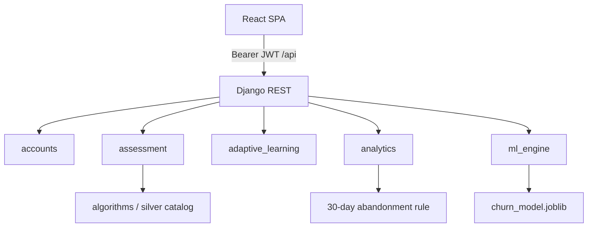

# Architecture

Cognitive learning platform — media-literacy / cognitive resilience research prototype.

| Layer | Tech | Path |
|-------|------|------|
| Frontend | React 18 + Vite + Tailwind | `cognitive-frontend/` |
| Backend | Django 5.2 + DRF + SimpleJWT | `coglearning/` |
| Database | SQLite locally; Postgres when env is set | see `coglearning/.env.example` |
| Algorithms | Silver test suite + runtime catalog | `silver_project/`, `coglearning/algorithms/` |
| Live ML | Churn RandomForest + retention banner | `coglearning/ml_engine/` |
| Offline ML | Abandonment training | `scripts/train_abandonment_model.py`, `models/` |

## Roles

Citizen = `student` · Domain expert = `teacher` · Manager = `admin`

## Request flow

## Django apps

- **accounts** — users, JWT, profile, algorithm preferences
- **assessment** — tests, sessions, grading, catalog filters
- **adaptive_learning** — content, paths, recommendations
- **analytics** — dashboards, engagement, abandonment rule
- **ml_engine** — churn features/inference, retention notifications

## Frontend

- `src/App.jsx` — role routes + guards
- `src/hooks/` — assessment, adaptive, analytics, ml
- `src/contexts/AuthContext.jsx` — JWT + logout blacklist
- `src/components/RetentionBanner.jsx` — churn-driven nudge

## Algorithms and ML (why there are two of each)

**Algorithms:** `silver_project/` holds the academic mutation/coverage suite. `coglearning/algorithms/` is what the API uses at runtime (via assessment catalog preferences / `catalog_bridge`).

**ML:** Live path is `GET /api/ml/churn/` → RandomForest joblib → retention banner. Offline path trains `models/abandonment_predictor.joblib`; the manager engagement UI still uses a 30-day inactivity rule at runtime.

## Deploy sketch

1. `DEBUG=False`, strong `SECRET_KEY`, `ALLOWED_HOSTS`, `CORS_ALLOWED_ORIGINS`, Postgres env
2. `pip install -r coglearning/requirements.txt`
3. `migrate` + `train_churn_model`
4. Serve Django + `cognitive-frontend/dist` behind TLS
