# فصل ۳ — تحلیل و طراحی سامانه

## ۳٫۱ مقدمه

این فصل سامانه را بر اساس کد واقعی تحلیل و طراحی می‌کند. دیاگرام‌ها به‌صورت **Mermaid** ارائه شده‌اند و جایگزین اسکرین‌شات هستند.

## ۳٫۲ نمای کلی سامانه

سامانه سنجش شناختی یک پلتفرم وب Client–Server است که شهروندان را ارزیابی و آموزش می‌دهد، مسئول شهری محتوا/آزمون را مدیریت می‌کند و مدیر شاخص‌های ماندگاری را می‌بیند.

## ۳٫۳ اهداف سامانه

1. ثبت‌نام/ورود امن با JWT  
2. تعیین سطح و ارتقای سطح ۱–۱۰۰  
3. ارائه محتوا و مسیر تطبیقی  
4. تصحیح آزمون‌های تشریحی  
5. پایش عملکرد و ترک‌کرده  

## ۳٫۴ ذی‌نفعان و نقش‌ها

| نقش | بازیگر | مسئولیت |
|-----|--------|---------|
| student | شهروند | آزمون، یادگیری، مشاهده پیشرفت |
| teacher | مسئول شهری (مدرس) | محتوا، آزمون، تصحیح |
| admin | مدیر سیستم | گزارش‌ها و engagement |

## ۳٫۵ نیازمندی‌های کارکردی (استخراج از پیاده‌سازی)

| شناسه | نیازمندی | وضعیت |
|-------|----------|--------|
| FR01 | ثبت‌نام و ورود JWT | پیاده |
| FR02 | مدیریت پروفایل | پیاده |
| FR03 | ایجاد/ویرایش آزمون و سؤال توسط مدرس | پیاده |
| FR04 | شرکت در آزمون و ثبت پاسخ | پیاده |
| FR05 | نمره‌دهی خودکار MCQ و دستی تشریحی | پیاده |
| FR06 | پیشنهاد و مسیر یادگیری | پیاده |
| FR07 | داشبورد شهروند/مدرس | پیاده |
| FR08 | شاخص ترک برای ادمین | پیاده |
| FR09 | قانون ۳۰ روزه ترک‌کرده | پیاده |
| FR10 | پیش‌بینی ML در API | پیاده‌نشده |
| FR11 | جستجو/مرتب‌سازی الگوریتمی در لیست آزمون API | پیاده‌سازی‌شده (`StudentTestListView` + UI) |

## ۳٫۶ نیازمندی‌های غیرکارکردی

| شناسه | نیازمندی | شواهد |
|-------|----------|--------|
| NFR01 | احراز هویت توکنی | SimpleJWT |
| NFR02 | تفکیک دسترسی نقش‌محور | permissions + route guards |
| NFR03 | CORS برای فرانت | django-cors-headers |
| NFR04 | قابلیت آزمون‌پذیری الگوریتم‌ها | ۳۷۶ تست |
| NFR05 | پیکربندی محیطی DB | `.env` |

## ۳٫۷ معماری کلی

**شکل ۳‑۱ — معماری سامانه**

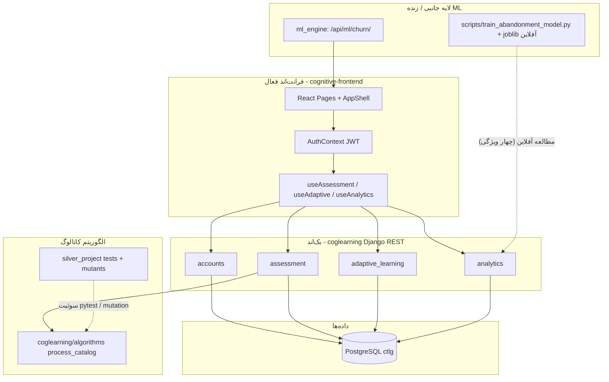

## ۳٫۸ گردش کلی پلتفرم

**شکل ۳‑۲ — گردش کلی**

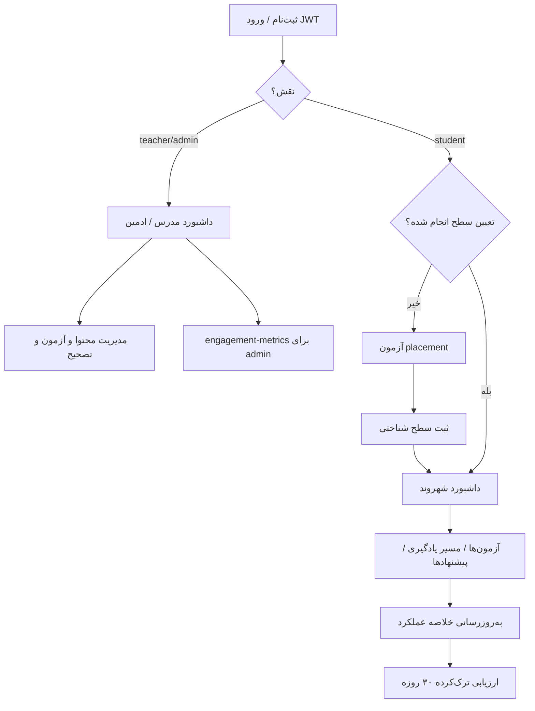

## ۳٫۹ گردش‌کار داشبوردها

### ۳٫۹٫۱ داشبورد شهروند

**ورودی:** توکن کاربر، داده‌های خلاصه عملکرد، مسیر، پیشنهاد، تاریخچه  
**API:** `GET /api/analytics/student-dashboard/`  
**خروجی:** سطح، رتبه، هشدارها، پیشنهادها، هم‌دوره‌ای‌ها  

**شکل ۳‑۳**

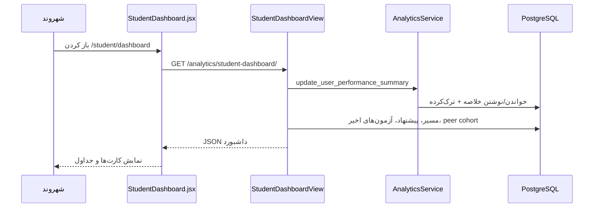

### ۳٫۹٫۲ داشبورد مدرس

**API:** `GET /api/analytics/teacher-dashboard/`  
**خروجی:** تعداد محتوا، آزمون، موارد pending_review  

**شکل ۳‑۴**

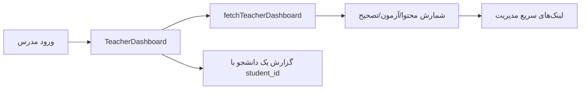

### ۳٫۹٫۳ داشبورد engagement ادمین

**API:** `GET /api/analytics/engagement-metrics/`  
**خروجی:** جدول شهروندان + قانون ۳۰ روزه  

**شکل ۳‑۵**

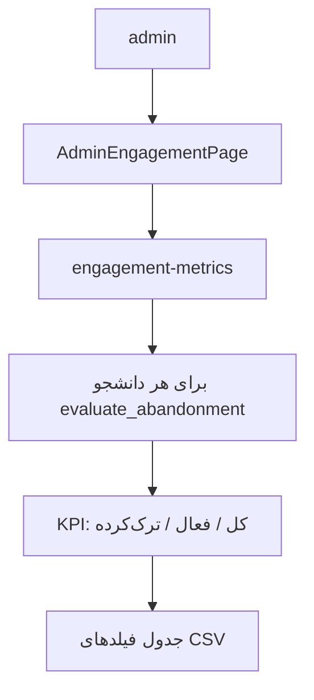

## ۳٫۱۰ نمودار Use Case

**شکل ۳‑۶**

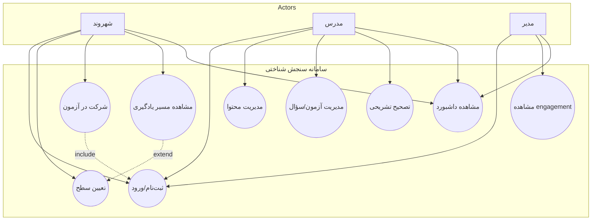

## ۳٫۱۱ طراحی پایگاه داده (ER)

**شکل ۳‑۷**

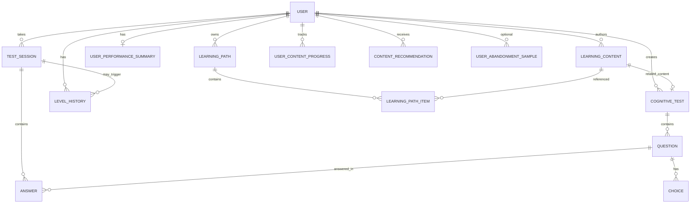

## ۳٫۱۲ نمودار کلاس (خلاصه سرویس‌محور)

**شکل ۳‑۸**

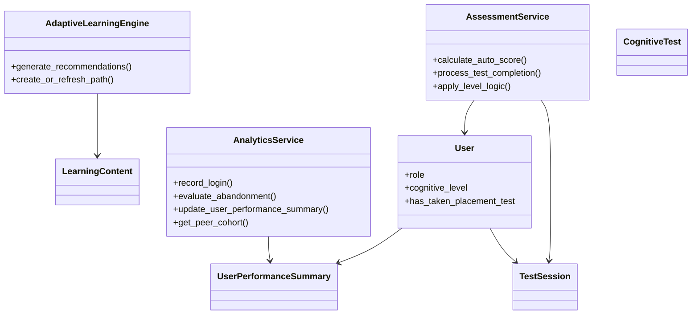

## ۳٫۱۳ نمودارهای توالی منتخب

### ورود

**شکل ۳‑۹**

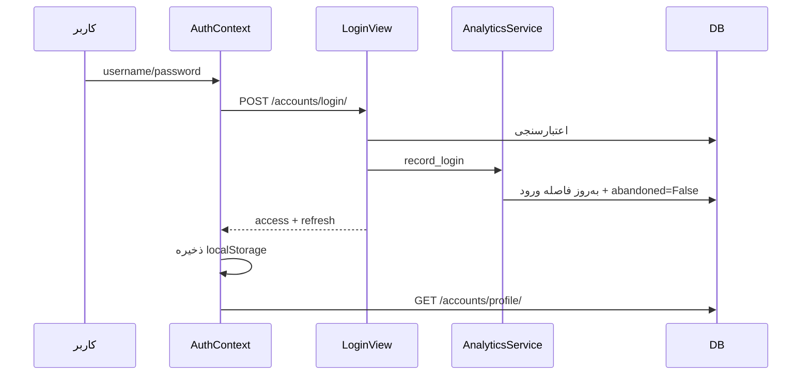

### شرکت در آزمون

**شکل ۳‑۱۰**

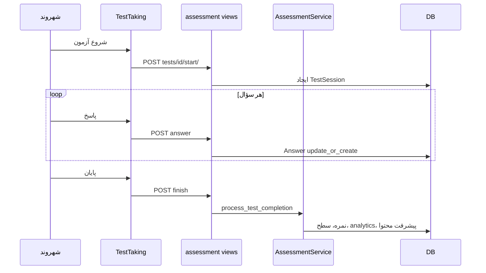

### پیش‌بینی ترک (وضعیت واقعی)

**شکل ۳‑۱۱ — تمایز قانون و ML**

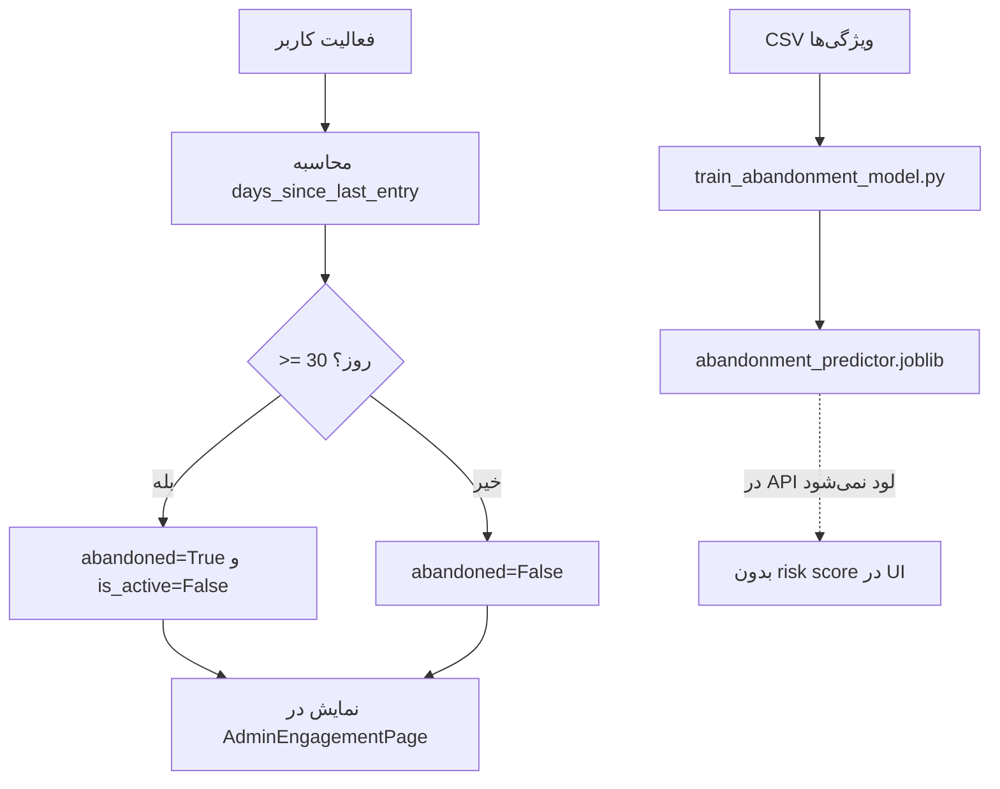

## ۳٫۱۴ نمودار فعالیت — پایان آزمون

**شکل ۳‑۱۲**

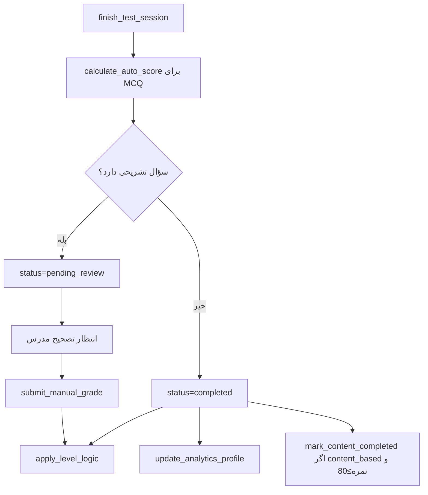

## ۳٫۱۵ DFD سطح ۰

**شکل ۳‑۱۳**

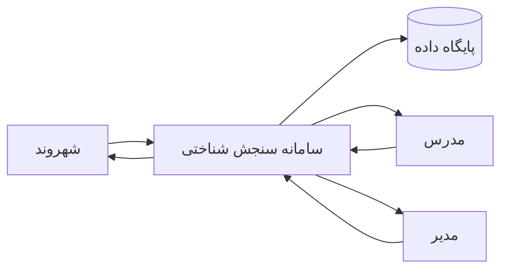

## ۳٫۱۶ تا ۳٫۲۱ طراحی ماژول‌ها

### ارزیابی
مدل‌های CognitiveTest/Question/Choice/TestSession/Answer و سرویس نمره‌دهی/سطح.

### یادگیری تطبیقی
LearningContent، Path، Progress، Recommendation + AdaptiveLearningEngine.

### تحلیل رفتار
UserPerformanceSummary، LevelHistory، LearningAnalytics، peer cohort.

### بازخورد
`teacher_feedback` در مدل موجود است؛ در `submit_manual_grade` فعلاً ست نمی‌شود (محدودیت). alerts داشبورد برای ضعف مهارت‌ها تولید می‌شود.

### ترک سامانه
قانون ۳۰ روزه در `AnalyticsService.evaluate_abandonment`؛ مدل آفلاین چهارویژگی جدا؛ پیش‌بینی زنده در `ml_engine` (`/api/ml/churn/`).

## ۳٫۲۲ جمع‌بندی فصل

طراحی ارائه‌شده مستقیماً از ساختار کد استخراج شده و مرز اجزای جانبی (الگوریتم/ML) با خطوط نقطه‌چین مشخص شده است.
