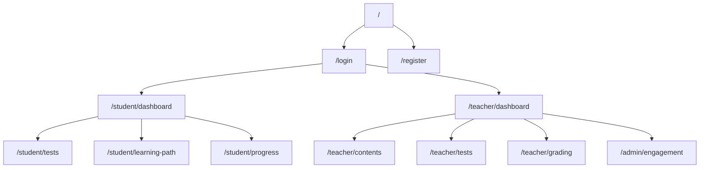
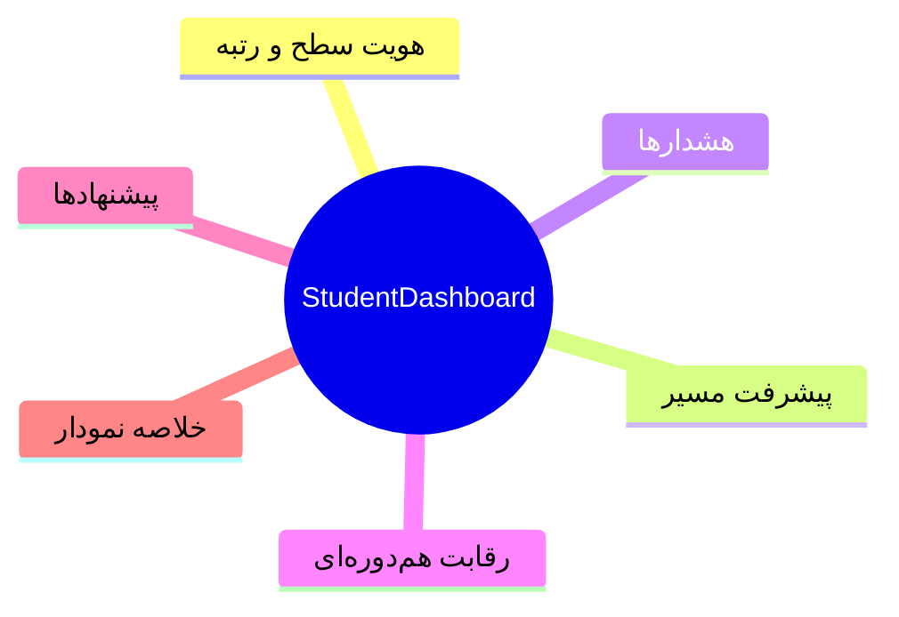
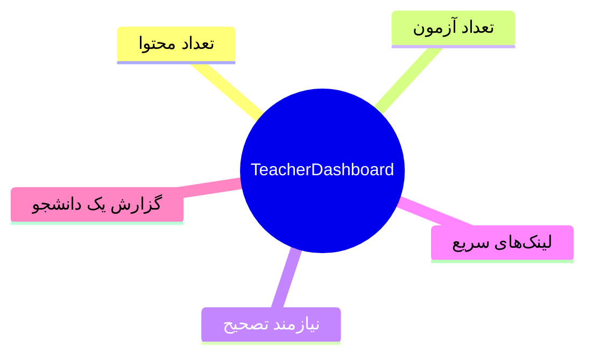
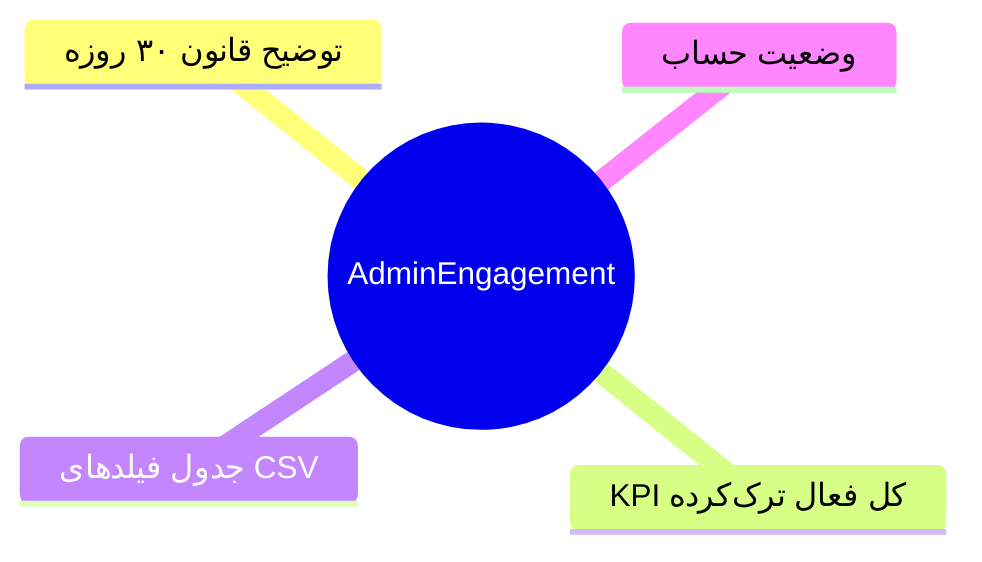
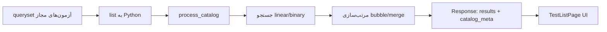

# فصل ۴ — پیاده‌سازی سامانه و الگوریتم‌ها

## ۴٫۱ مقدمه

این فصل پیاده‌سازی را بر اساس مسیر فایل‌ها و رفتار واقعی کد شرح می‌دهد.

## ۴٫۲ فناوری‌ها و ابزارها

جدول نسخه‌های تأییدشده در محیط ممیزی (۲۵ ژوئیه ۲۰۲۶):

| لایه | فناوری | نسخه |
|------|--------|------|
| زبان بک‌اند | Python | 3.13.5 |
| فریم‌ورک | Django | 5.2.7 |
| API | DRF | 3.16.1 |
| احراز هویت | SimpleJWT | 5.5.1 |
| DB | PostgreSQL + psycopg | 3.3.4 |
| فرانت | React | 18.3.1 |
| Bundler | Vite | 7.3.1 |
| نمودار UI | recharts | 3.7.0 |
| ML | scikit-learn / pandas / joblib | 1.9.0 / 2.3.1 / 1.5.3 |

## ۴٫۳ ساختار پروژه

```
ctlg-2/
├── coglearning/                 # بک‌اند Django
│   ├── accounts/
│   ├── assessment/
│   ├── adaptive_learning/
│   ├── analytics/
│   └── coglearning/settings.py
├── cognitive-frontend/          # فرانت‌اند فعال
├── coglearning/algorithms/      # الگوریتم‌های production (API)
├── silver_project/algorithms/   # همان منطق + تست/جهش
├── scripts/train_abandonment_model.py
├── datasets/
└── models/abandonment_predictor.joblib
```

## ۴٫۴ پیاده‌سازی فرانت‌اند

فرانت فعال در `cognitive-frontend/` با RTL فارسی، `AppShell`، محافظ مسیر نقش‌محور و axios client با refresh token پیاده شده است.

**شکل ۴‑۱ — نقشه مسیرهای اصلی UI**



نسخه قدیمی داخل `coglearning/cognitive-frontend/` به‌عنوان مرجع تاریخی در نظر گرفته شود، نه منبع حقیقت UI.

## ۴٫۵ پیاده‌سازی بک‌اند

مسیر ریشه API در `coglearning/coglearning/urls.py`:

- `/api/accounts/`
- `/api/assessment/`
- `/api/adaptive-learning/`
- `/api/analytics/`

Views عمدتاً `APIView`/`generics` و `@api_view` هستند (بدون ViewSet).

## ۴٫۶ پایگاه داده

موتور: PostgreSQL با متغیرهای `POSTGRES_*`.  
Migrationهای اپ‌های سفارشی اعمال شده‌اند. مدل‌ها در فصل ۳ آمده‌اند.

## ۴٫۷ احراز هویت و مجوز

- ورود سفارشی `LoginView` پس از موفقیت `record_login` را صدا می‌زند.  
- مجوزها: `IsAdminUser`, `IsTeacher`, `HasTakenPlacementTest`.  
- فرانت: `access_token`/`refresh_token` در localStorage.

## ۴٫۸ مدیریت کاربران

`User` با نقش‌های student/teacher/admin. سطح شناختی فقط برای دانشجو معنا دارد و برای سایر نقش‌ها در `save()` برابر `None` می‌شود.

## ۴٫۹ ماژول ارزیابی

چرخه:

1. فیلتر آزمون‌های مجاز بر اساس placement و `min_level`  
2. `start_test_session` با `expires_at`  
3. ثبت پاسخ  
4. `process_test_completion`  

منطق سطح:

- placement: سطح ≈ نمره  
- قبولی عمومی/محتوایی: افزایش ۲ یا ۵ پله با شرایط  

> `expires_at` ست می‌شود اما در کد enforce زمان انقضا یافت نشد.

## ۴٫۱۰ یادگیری تطبیقی

- `generate_recommendations`: حذف پیشنهاد قبلی، انتخاب تا ۱۰ محتوا در بازه سطح  
- `create_or_refresh_path`: غیرفعال‌سازی مسیر قبلی و ساخت مسیر جدید  
- roadmap: محتوای آینده بر اساس سطح  

## ۴٫۱۱ تحلیل رفتار

`update_user_performance_summary` میانگین مهارت‌ها، تعداد آزمون، failed، مدت استفاده و progress_rate را محاسبه و سپس قانون ترک را اعمال می‌کند.

## ۴٫۱۲ بازخورد

- alerts ضعف مهارت در داشبورد شهروند  
- تصحیح تشریحی توسط مدرس  
- فیلد `teacher_feedback` در مدل موجود است ولی در مسیر grade فعلی پر نمی‌شود  

## ۴٫۱۳ داشبوردها (نمای ساختاری Mermaid)

به‌جای اسکرین‌شات، ساختار اطلاعات هر داشبورد:

**شکل ۴‑۲ — ساختار داشبورد شهروند**



**شکل ۴‑۳ — ساختار داشبورد مدرس**



**شکل ۴‑۴ — ساختار پنل ترک ادمین**



## ۴٫۱۴ تا ۴٫۱۶ الگوریتم‌های کاتالوگ

پیاده‌سازی production در `coglearning/algorithms` (هم‌تراز با `silver_project/algorithms` برای تست):

| تابع | پیچیدگی تقریبی |
|------|----------------|
| bubble_sort | O(n²) |
| merge_sort | O(n log n) |
| linear_search | O(n) |
| binary_search | O(log n) |

**شکل ۴‑۵ — pipeline کاتالوگ (متصل به API)**



**اتصال runtime:** `StudentTestListView.list` پارامترهای `q`, `search_algo`, `sort_algo`, `sort_by`, `sort_order` را می‌خواند؛ در صورت نبود، از ترجیحات پروفایل (`preferred_sort_algorithm`, `preferred_search_algorithm`, `default_sort_field`) استفاده می‌کند.

ترجیحات الگوریتم در مدل `User` و صفحه پروفایل قابل تنظیم است.

## ۴٫۱۷ ترک سامانه در پیاده‌سازی

```text
days_since_last_entry = now - max(last_login, last_test_start, last_login_event, date_joined)
if days >= ABANDONMENT_INACTIVITY_DAYS (default 30):
    abandoned = True; user.is_active = False
```

ورود مجدد (اگر مجاز باشد) با `record_login` پرچم ترک را پاک می‌کند.

## ۴٫۱۸ خط ML آفلاین

`scripts/train_abandonment_model.py` داده CSV را می‌خواند، مدل‌ها را مقایسه و `models/abandonment_predictor.joblib` را می‌نویسد. جزئیات در فصل ۶.

## ۴٫۱۹ جمع‌بندی

هسته سامانه (کاربر، آزمون، یادگیری، داشبورد، قانون ترک، کاتالوگ الگوریتمی) پیاده است. inference ML در مسیر تولید کامل متصل نیست و باید شفاف گزارش شود.
