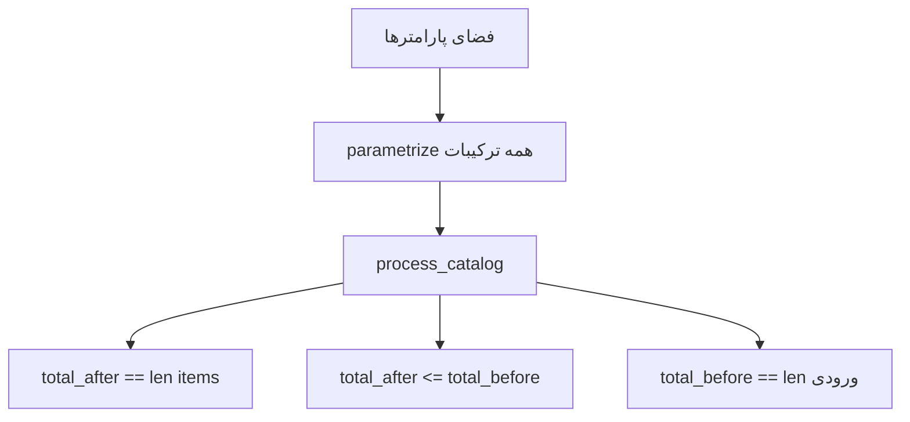
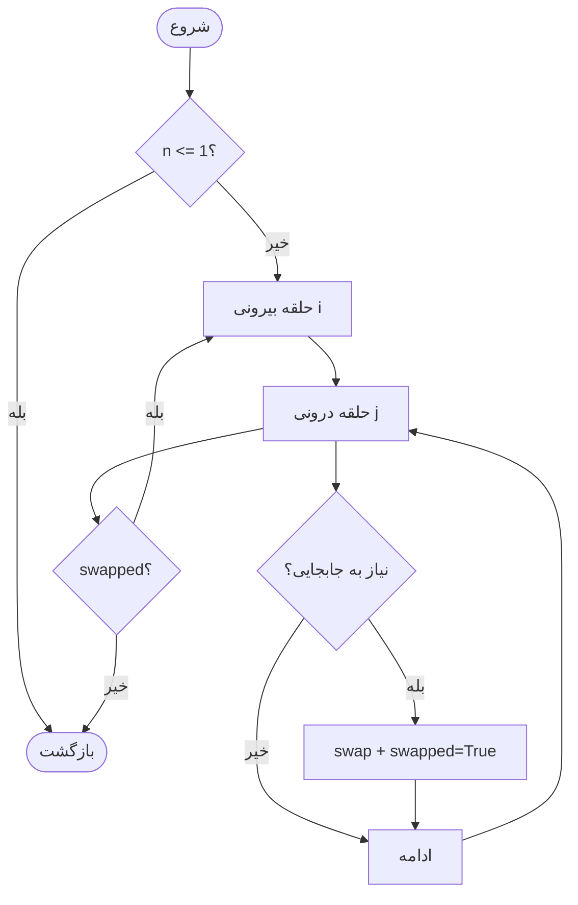

# فصل ۵ — آزمون نرم‌افزار و ارزیابی کیفیت

## ۵٫۱ مقدمه

این فصل کیفیت ماژول الگوریتم‌های جستجو و مرتب‌سازی را بر اساس کد و اجرای واقعی pytest در `silver_project` مستند می‌کند.

## ۵٫۲ اهداف آزمون

1. صحت کارکرد Bubble/Merge/Linear/Binary و `process_catalog`  
2. پوشش ترکیبات پارامتر (ACOC)  
3. پوشش عناصر CFG  
4. سنجش قدرت مجموعه تست با Mutation Testing  

## ۵٫۳ راهبرد آزمون

آزمون‌ها واحد/خاصیت‌محور هستند و روی توابع خالص پایتون اجرا می‌شوند (بدون نیاز به Django runtime). ابزار: pytest (+ pytest-cov). جهش‌ها به‌صورت دستی در `mutants/` تعریف شده‌اند؛ cache اجرای mutmut در مخزن موجود نیست.

## ۵٫۴ معماری تست

```
algorithms/tests/
  test_coverage.py          # ACOC + Node/Edge/Prime Path
  test_mutation_killing.py  # کشتن جهش‌های AOR + محاسبه score
algorithms/mutants/
  sorting_mutants.py
  searching_mutants.py
  catalog_mutants.py
```

## ۵٫۵ ACOC

پارامترها: size × order × sort_field × sort_algo × query × search_algo  
تعداد تست ترکیب کاتالوگ: **۳۲۴**  
تست ترتیب خروجی مرتب‌سازی: **۶**

**شکل ۵‑۱ — ایده ACOC**



> یافته ممیزی: پارامتر `order` در عمل روی داده‌های فعلی بی‌اثر است (بعد طول size حداکثر ۲)، ولی تست‌ها همچنان اجرا می‌شوند.

## ۵٫۶ گراف جریان کنترل (مفهومی)

برای Bubble Sort، تصمیم‌های swap/early-exit؛ برای Binary Search شاخه‌های left/right/mid؛ برای Merge Sort تقسیم/ادغام؛ برای catalog مسیر binary در برابر linear پوشش داده شده‌اند.

**شکل ۵‑۲ — CFG ساده‌شده Bubble Sort**



## ۵٫۷ پوشش گره (Node Coverage)

کلاس `TestNodeCoverage` با ۱۴ تست حالت‌های خالی، تک‌عنصر، مرتب، معکوس، یافت/نیافت جستجو و پیش‌فرض الگوریتم نامعتبر را پوشش می‌دهد.

## ۵٫۸ پوشش یال (Edge Coverage)

۹ تست شاخه‌های swap/no-swap، reverse، left/right/mid باینری و مسیرهای catalog را هدف می‌گیرد.

## ۵٫۹ پوشش مسیر نخستین (Prime Path)

۶ تست مسیرهای عمیق‌تر: حلقه‌های کامل bubble، بازگشتی merge، چند تکرار binary و pipeline کامل catalog.

## ۵٫۱۰ تا ۵٫۱۴ آزمون جهش AOR

۱۴ جهش حسابی:

| گروه | تعداد | نتیجه |
|------|------:|--------|
| Bubble Sort BS-01..04 | 4 | Killed |
| Merge Sort MS-01..02 | 2 | Killed |
| Merge Sort MS-03 | 1 | Equivalent |
| Binary BN-01,02,04,05 | 4 | Killed |
| Binary BN-03 | 1 | Equivalent |
| Catalog PC-01,02 | 2 | Killed (PC-01 با assert جدید) |

## ۵٫۱۵ امتیاز جهش

\[
MS = \frac{Killed}{Total - Equivalent} \times 100
\]

| حالت | Killed | Score |
|------|-------:|------:|
| قبل از assert روی total_before | 10/12 | 83.3٪ |
| بعد از اصلاح | 11/12 | **91.7٪** |

Live نهایی غیرمعادل: ۰

## ۵٫۱۶ نتایج اجرا

اجرای واقعی در محیط ممیزی:

```text
376 passed in 8.56s ~ 8.93s
```

تفکیک تقریبی: ACOC 330 + CFG 29 + Mutation 17 = 376

پوشش کد (pytest-cov): sorting/searching ≈ ۱۰۰٪؛ catalog ≈ ۹۷٪؛ کل پکیج ≈ ۷۷٪.

## ۵٫۱۷ مقایسه معیارهای پوشش

| معیار | قدرت نسبی | نقش در پروژه |
|-------|-----------|--------------|
| Node | پایه | اطمینان از اجرای بلوک‌ها |
| Edge | متوسط | شاخه‌ها |
| Prime Path | قوی‌تر | مسیرهای ترکیبی |
| Mutation | سنجش کیفیت تست | آشکارسازی ضعف assert |

## ۵٫۱۸ بحث

نقطه قوت: مجموعه تست غنی و بهبود Mutation Score پس از تقویت assert.  
محدودیت: عدم اتصال به API؛ تناقض‌های مستند `ALGORITHM_TESTING_REPORT_FA.md` با مسیرهای `coglearning/algorithms`؛ ناسازگاری جزئی در `mutants/__init__.py`.

## ۵٫۱۹ جمع‌بندی

کیفیت ماژول الگوریتم از منظر آزمون واحد/ترکیبی و جهش مطلوب است، اما این کیفیت هنوز به مسیر تولید سامانه اصلی منتقل نشده است.
