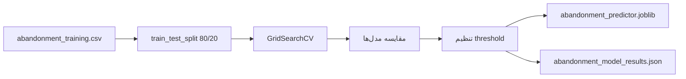
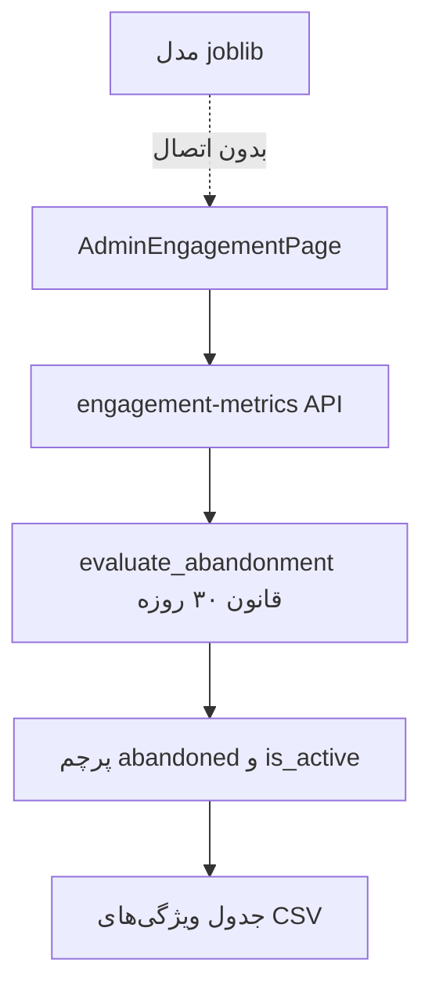

# فصل ۶ — پیش‌بینی ترک سامانه و یادگیری ماشین

## ۶٫۱ مقدمه

این فصل دو لایه متمایز را جدا می‌کند: (۱) قانون عملیاتی ترک‌کرده در پلتفرم، (۲) آموزش آفلاین مدل ML.

## ۶٫۲ تعریف مسئله ML

ورودی: چهار ویژگی رفتاری  
خروجی: ترک / عدم ترک (`abandoned`)

## ۶٫۳ دیتاست

- مسیر: `datasets/abandonment_training.csv`  
- تعداد: ۲۰۰۰ نمونه (+ هدر)  
- توزیع در نتایج فعلی: ۹۷۱ abandoned / ۱۰۲۹ retained  
- تولید: `seed_abandonment_dataset` با برچسب قطعی `avg_login_interval_days >= 30`

## ۶٫۴ ویژگی‌ها و متغیر هدف

مطابق فصل ۲ و مدل `UserAbandonmentSample` / فیلدهای `UserPerformanceSummary`.

## ۶٫۵ پیش‌پردازش

- تبدیل به float  
- StandardScaler فقط برای Logistic Regression  
- بدون imputation پیچیده  

## ۶٫۶ تقسیم داده

- Holdout 80/20 با stratify و `random_state=42`  
- CV سه‌لایه StratifiedKFold برای تنظیم  

## ۶٫۷ انتخاب و آموزش مدل

مدل‌های مقایسه‌شده:

1. LogisticRegression (balanced)  
2. RandomForest + GridSearch  
3. HistGradientBoosting + GridSearch  
4. CalibratedClassifierCV روی HGB  

معیار انتخاب ترکیبی: `0.55*F1 + 0.45*ROC_AUC` و تنظیم آستانه تصمیم.

## ۶٫۸ نتایج آزمایش (از `abandonment_model_results.json`)

| مدل | Accuracy | Precision | Recall | F1 | ROC-AUC |
|-----|---------:|----------:|-------:|---:|--------:|
| RandomForest_Tuned | 1.000 | 1.000 | 1.000 | 1.000 | 1.000 |
| HistGradientBoosting_Tuned | 1.000 | 1.000 | 1.000 | 1.000 | 1.000 |
| Calibrated_HGB | 0.9975 | 0.9949 | 1.000 | 0.9974 | 0.9976 |
| LogisticRegression | 0.9975 | 1.000 | 0.9948 | 0.9974 | 1.000 |

- مدل نهایی ذخیره‌شده: **RandomForest_Tuned**  
- آستانه: **۰٫۳۳**  
- Confusion Matrix: tn=206, fp=0, fn=0, tp=194  

**شکل ۶‑۱ — pipeline آموزش**

## ۶٫۹ تفسیر علمی نتایج

نزدیک‌به‌کامل بودن متریک‌ها ناشی از **جداسازی قطعی کلاس‌ها بر اساس آستانه ۳۰ روی همان ویژگی فاصله ورود** است. بنابراین این نتایج را نباید به‌عنوان موفقیت پیش‌بینی زودهنگام تفسیر کرد. اهمیت جایگشتی نیز عمدتاً روی `avg_login_interval_days` متمرکز است.

> فایل `abandonment_model_summary.txt` نتایج قدیمی‌تری (حدود Accuracy 0.78) دارد و با JSON فعلی ناسازگار است؛ مرجع پایان‌نامه باید JSON/joblib هم‌زمان باشد.

## ۶٫۱۰ یکپارچه‌سازی با پلتفرم

| قابلیت | وضعیت |
|--------|--------|
| محاسبه فیلدهای engagement از فعالیت واقعی | پیاده |
| نمایش در `/admin/engagement` | پیاده |
| اعمال قانون ۳۰ روزه + deactivate | پیاده |
| `joblib.load` و predict در Django | **نیست** |
| نمایش احتمال ریسک در UI | **نیست** |

**شکل ۶‑۲ — آنچه کاربر ادمین واقعاً می‌بیند**

## ۶٫۱۱ کاربرد عملی ایده‌آل (آینده، نه پیاده‌شده)

در صورت اتصال مدل، می‌توان برای کاربران پرریسک هشدار مدرس، یادآوری ورود یا ساده‌سازی مسیر یادگیری تعریف کرد. این موارد فعلاً Future Work هستند.

## ۶٫۱۲ تا ۶٫۱۶ بحث و جمع‌بندی

دستاورد فصل: تعریف شفاف دو لایه ترک، وجود داده و مدل آموزش‌دیده، و یکپارچگی عملیاتی قانون ۳۰ روزه.  
محدودیت اصلی: نبود inference و برچسب‌گذاری تقریباً deterministic در CSV که ارزیابی پیش‌بینی را متورم می‌کند.
