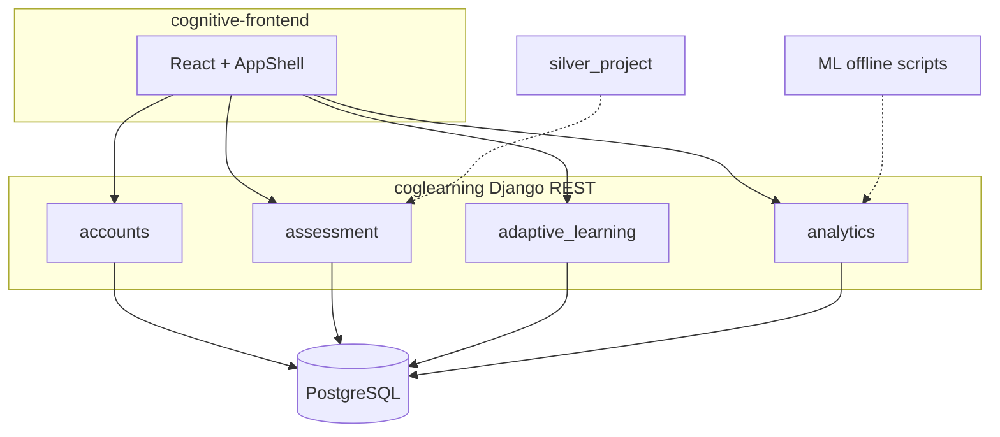
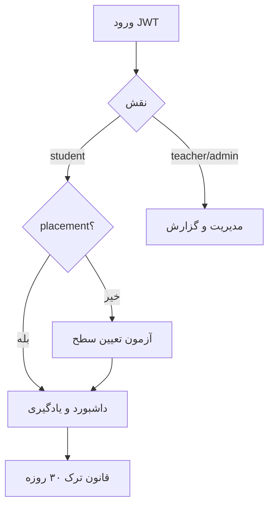
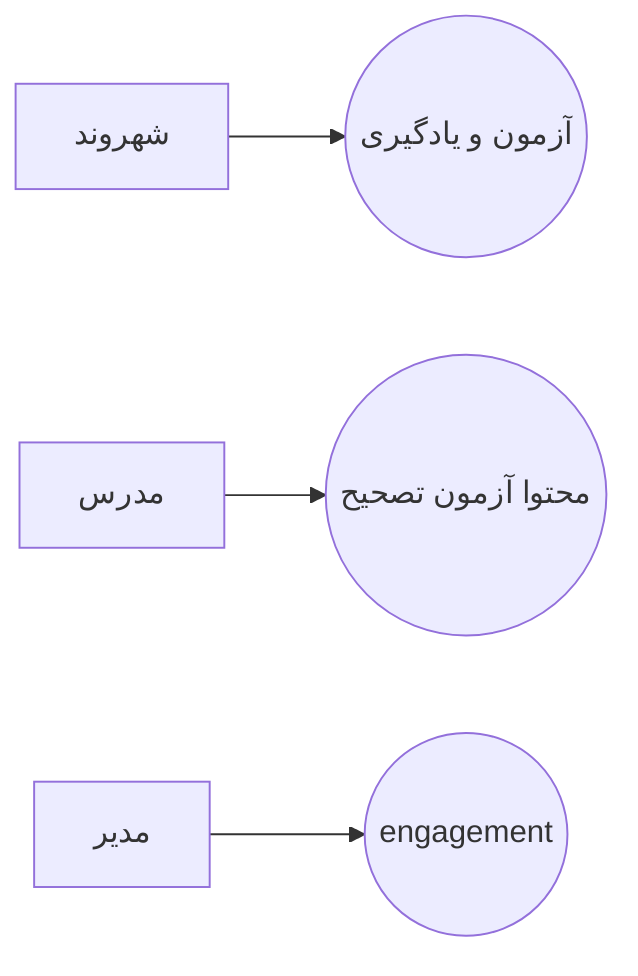
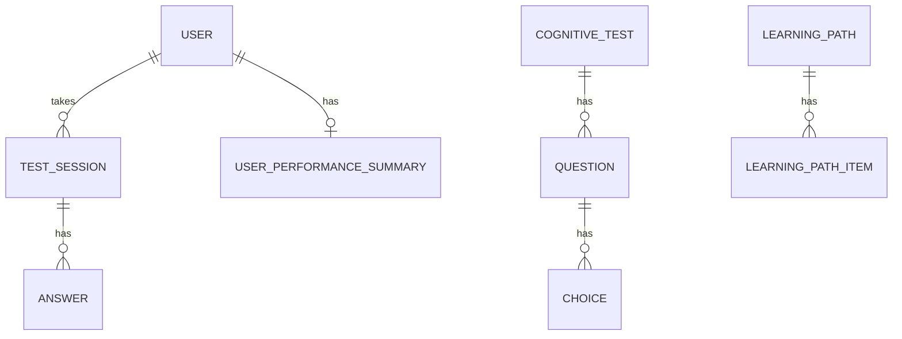
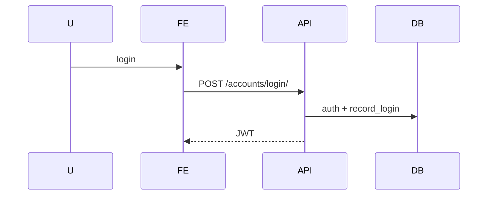
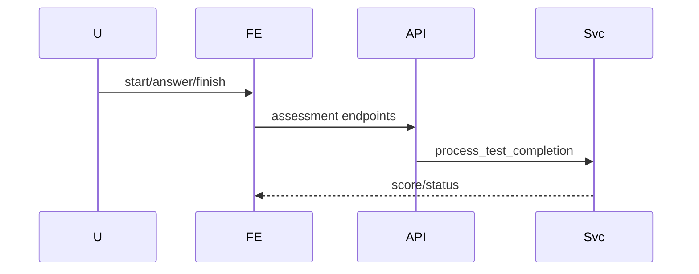
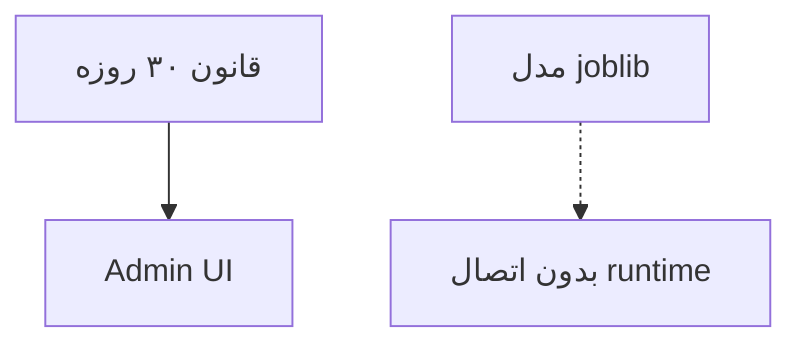
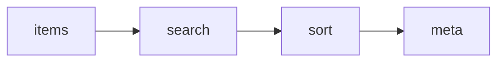
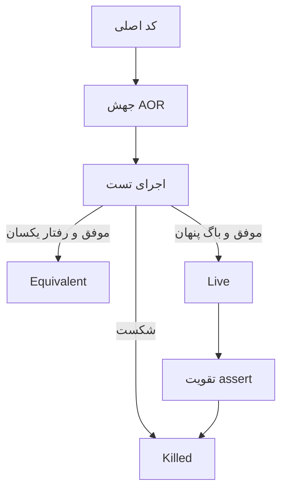
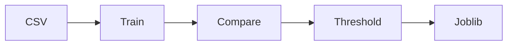

# مراجع و پیوست‌ها

## مراجع

> فقط منابعی که واقعاً به پروژه/ابزارها مربوط‌اند. مقاله تیم به‌دلیل نبود فایل، با عنوان README ذکر شده و باید پس از دریافت نسخه نهایی تکمیل شود.

[1] تیم پروژه ctlg، «A Framework for Enhancing Media Literacy and Mitigating Cognitive Threats in Urban Governance»، README مخزن نرم‌افزاری، ۲۰۲۶. *(جایگزین موقت مقاله؛ نیاز به تکمیل کتابشناختی)*

[2] Django Software Foundation, *Django Documentation*, v5.2. Available: https://docs.djangoproject.com/

[3] Encode, *Django REST Framework Documentation*. Available: https://www.django-rest-framework.org/

[4] Simple JWT, *JSON Web Token authentication for DRF*. Available: https://django-rest-framework-simplejwt.readthedocs.io/

[5] React Team, *React Documentation*. Available: https://react.dev/

[6] Vite Team, *Vite Documentation*. Available: https://vitejs.dev/

[7] Pedregosa et al., “Scikit-learn: Machine Learning in Python,” *JMLR*, 2011.

[8] pytest developers, *pytest Documentation*. Available: https://docs.pytest.org/

[9] Ammann, P. and Offutt, J., *Introduction to Software Testing*, Cambridge University Press. *(مرجع کلاسیک پوشش مسیر و جهش)*

[10] مستند داخلی پروژه، `silver_project/ALGORITHM_TESTING_REPORT_FA.md`، ۲۰۲۶. *(با اصلاح مسیرها نسبت به کد واقعی استفاده شود)*

[11] نتایج مدل، `datasets/ml/abandonment_model_results.json`، اجرای آموزش روی CSV فعلی.

[12] PostgreSQL Global Development Group, *PostgreSQL Documentation*. Available: https://www.postgresql.org/docs/

---

# پیوست A — مجموعه کدهای Mermaid

تمام دیاگرام‌های اصلی برای کپی در ابزار رندر Mermaid / Typora / GitHub / VS Code.

## A.1 معماری سامانه



## A.2 گردش کلی



## A.3 Use Case فشرده



## A.4 ER خلاصه



## A.5 Sequence ورود



## A.6 Sequence آزمون



## A.7 قانون ترک در برابر ML



## A.8 Pipeline کاتالوگ



## A.9 Mutation lifecycle



## A.10 ML pipeline



---

# پیوست B — جایگزین اسکرین‌شات

به‌جای تصویر صفحات، از mindmap/flowchartهای فصل ۴ استفاده شود. در صورت نیاز دانشگاه به اسکرین‌شات واقعی، تیم می‌تواند از مسیرهای زیر عکس بگیرد:

`/login`, `/student/dashboard`, `/student/tests`, `/student/learning-path`, `/teacher/dashboard`, `/admin/engagement`

---

# پیوست C — جداول تکمیلی سریع

### C.1 نقش‌ها و مسیرهای اصلی

| نقش | مسیرهای کلیدی |
|-----|----------------|
| student | `/student/*` |
| teacher | `/teacher/*` |
| admin | `/admin/engagement` + مسیرهای teacher |

### C.2 دستورات بازتولید نتایج

```powershell
cd coglearning
python manage.py check

cd ..\silver_project
python -m pytest algorithms/tests/ -q

cd ..
python scripts/train_abandonment_model.py
```

---

# پیوست D — نمونه‌های کد مهم (اشاره مسیر)

| موضوع | مسیر |
|-------|------|
| مدل کاربر | `coglearning/accounts/models.py` |
| منطق سطح | `coglearning/assessment/services.py` |
| موتور تطبیقی | `coglearning/adaptive_learning/services.py` |
| ترک‌کرده | `coglearning/analytics/services.py` |
| آموزش ML | `scripts/train_abandonment_model.py` |
| process_catalog | `silver_project/algorithms/catalog.py` |
| Mutation tests | `silver_project/algorithms/tests/test_mutation_killing.py` |

---

**پایان سند پایان‌نامه (نسخه متنی کامل با Mermaid).**
