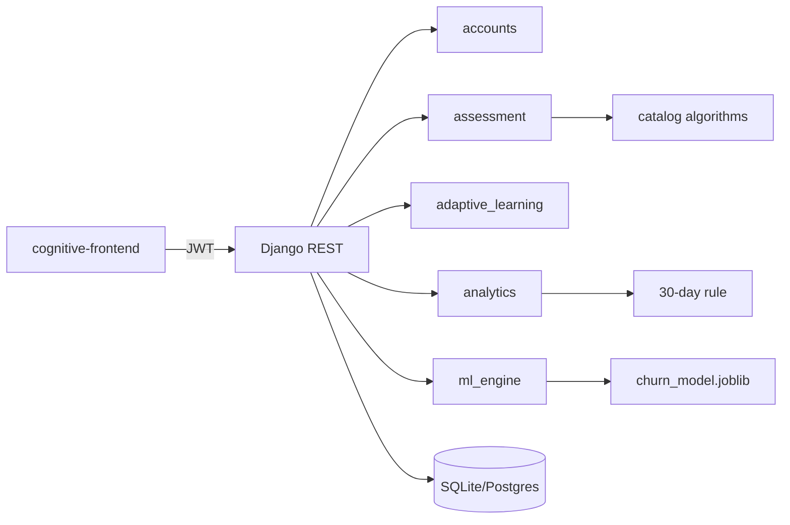

# سند طراحی پاورپوینت دفاع — سامانه سنجش شناختی (ctlg)

> **منبع حقیقت:** کد مخزن `ctlg-1` (Backend / Frontend / scripts / datasets) + `archive/2026-audit` + مقالات علمی با DOI.  
> **قانون:** هیچ ویژگی یا عددی ساخته نشده؛ اگر در پروژه نبوده با «در پروژه پیدا نشد» مشخص شده.  
> **کاربرد:** این سند را اسلایدبه‌اسلاید وارد PowerPoint کنید. متن داخل اسلاید کوتاه است؛ توضیح کامل در «متن شفاهی» است.

---

# مرحله ۱ — گزارش تحلیل پروژه (شواهد کد)

## وضعیت هر ادعا

| موضوع | وضعیت |
|--------|--------|
| ارزیابی شناختی (آزمون + سطح ۱–۱۰۰) | **پیاده‌سازی‌شده** |
| یادگیری تطبیقی (پیشنهاد ±۵، مسیر، قفل) | **پیاده‌سازی‌شده** |
| Learning Analytics (داشبوردها، LevelHistory، خلاصه عملکرد) | **پیاده‌سازی‌شده** (رویدادنگاری گسترده محدود است) |
| قانون ترک‌کرده ۳۰ روزه (admin engagement) | **پیاده‌سازی‌شده** |
| پیش‌بینی churn زنده (`/api/ml/churn/` + RetentionBanner) | **پیاده‌سازی‌شده** |
| مدل آفلاین abandonment روی CSV چهارویژگی | **موجود** (آموزش/ارزیابی آفلاین؛ **به داشبورد ادمین وصل نیست**) |
| الگوریتم‌های Sort/Search در کاتالوگ آزمون | **پیاده‌سازی‌شده در Backend**؛ UI ترجیح الگوریتم **ندارد** |
| سوئیت تست الگوریتم Silver (۳۷۶ تست) | **موجود** (`silver_project/`) |
| چارچوب «سواد رسانه‌ای / حکمرانی شهری» | **ایده/زمینه پژوهشی در README**؛ منطق دامنهٔ خاص رسانه در کد عمومی نیست |
| Cognitive Diagnosis Model علمی (CDM/NCD) | **در پروژه پیدا نشد** (سطح عددی + دسته سؤال memory/focus/logic) |
| تایمر اجباری آزمون (`expires_at`) | **ناقص** (فیلد هست؛ در finish چک نمی‌شود) |
| تصحیح خودکار تشریحی | **در پروژه پیدا نشد** (`correct_text_answer` ذخیره می‌شود ولی مقایسه نمی‌شود) |

---

### ۱. عنوان و موضوع دقیق

**عنوان پیشنهادی پایان‌نامه (از `thesis/README.md`):**  
طراحی و پیاده‌سازی سامانه ارزیابی شناختی و یادگیری تطبیقی با تحلیل رفتار کاربر، ارزیابی کیفیت نرم‌افزار و بررسی پیش‌بینی ترک سامانه

**آنچه کد واقعاً هست:** پروتوتایپ وب سه‌نقشی (شهروند / مسئول شهری / مدیر) با React + Django REST + JWT برای سنجش سطح شناختی، یادگیری تطبیقی سطح‌محور، داشبوردهای تحلیلی، قانون ترک ۳۰روزه، و inference زنده churn.

### ۲. مسئله اصلی

یادگیرندگان با سطح و رفتار متفاوت‌اند؛ بدون سنجش سطح، مسیر یادگیری یکسان، و بدون رصد تعامل/ترک، مداخلهٔ به‌موقع دشوار است. پروژه این حلقه را در یک سامانهٔ یکپارچه پیاده می‌کند.

### ۳. هدف پروژه

1. سنجش اولیه و به‌روزرسانی سطح شناختی (۱–۱۰۰)  
2. پیشنهاد محتوا و مسیر یادگیری بر اساس سطح  
3. ثبت و نمایش تحلیل عملکرد و تعامل  
4. شناسایی ریسک ترک (قانون عملیاتی + مدل churn)  
5. ارزیابی کیفیت نرم‌افزار (تست Django / E2E / سوئیت الگوریتم)

### ۴. ایده و انگیزه

از README: چارچوب پژوهشی سواد رسانه‌ای و تاب‌آوری شناختی در فضای حکمرانی شهری.  
**تمایز ایده vs کد:** ایدهٔ دامنه در README است؛ پیاده‌سازی فعلی یک **پلتفرم عمومی سنجش/یادگیری شناختی** است (محتوا و آزمون‌ها توسط معلم تعریف می‌شوند، نه منطق اختصاصی تشخیص اخبار جعلی).

### ۵. سامانه شناختی چه می‌کند؟

- آزمون تعیین سطح → سطح عددی  
- آزمون‌های محتوایی/عمومی با دسته‌های memory / focus / logic  
- پیشنهاد محتوا در باند سطح ±۵  
- مسیر یادگیری با قفل بر اساس `min_level`  
- پروفایل شناختی میانگین دسته‌ها در داشبورد  
- اعلان ماندگاری مبتنی بر churn برای شهروند

### ۶. مسیر کاربر (شهروند)

ثبت‌نام/ورود → (اگر placement نگرفته) آزمون تعیین سطح → داشبورد → آزمون‌ها / مسیر / پیشنهادها / پیشرفت → نتیجه و تاریخچه → (احتمالاً) بنر Retention

### ۷. Frontend — صفحات واقعی

| مسیر | نقش | کار واقعی |
|------|-----|-----------|
| `/login`, `/register`, `/profile` | همه | JWT، پروفایل |
| `/student/placement-test` | student | لیست آزمون placement |
| `/student/dashboard` | student+placement | سطح، رتبه، هشدار، پیشنهاد، peer |
| `/student/tests`, `.../take`, `.../result`, `/history` | student | کاتالوگ، شرکت، نتیجه |
| `/student/learning-path`, `/recommended`, `/progress`, `/content/:id`, `/adaptive-dashboard` | student | تطبیقی |
| `/teacher/*` | teacher یا admin | محتوا، آزمون، سؤال، تصحیح |
| `/manager/dashboard`, `/manager/engagement` | admin | گزارش سیستم + جدول ترک |

**در UI پیدا نشد:** تنظیم Sort/Search الگوریتم، نمایش `catalog_meta`، تایمر آزمون، نمرهٔ عددی churn روی بنر (فقط متن اعلان).

### ۸. Backend — اپ‌ها

`accounts`, `assessment`, `adaptive_learning`, `analytics`, `ml_engine` (+ `algorithms` برای کاتالوگ)

### ۹. Database — مدل‌های کلیدی

User (role, cognitive_level, has_taken_placement_test, prefs الگوریتم) · CognitiveTest · Question · Choice · TestSession · Answer · LearningContent · LearningPath/Item · UserContentProgress · ContentRecommendation · LevelHistory · LearningAnalytics · UserPerformanceSummary · UserAbandonmentSample · ChurnPrediction · RetentionNotification  
DB: SQLite محلی / Postgres با env.

### ۱۰. APIهای مهم

`/api/accounts/*` · `/api/assessment/*` · `/api/adaptive-learning/*` · `/api/analytics/*` · `/api/ml/churn/`, `/api/ml/notifications/`

### ۱۱. دادهٔ ذخیره‌/تحلیل‌شده از کاربر

پروفایل و سطح · جلسات و پاسخ‌ها · پیشرفت محتوا · کلیک پیشنهاد · تاریخچه سطح · رویداد login · خلاصه عملکرد (فاصله ورود، مدت استفاده، شکست آزمون، progress_rate، abandoned) · snapshot ویژگی‌های churn

### ۱۲. ویژگی‌های رفتار کاربر

**قانون ۳۰روزه / engagement:** `avg_login_interval_days`, `duration_of_use_minutes`, `failed_tests_count`, `progress_rate`, days since last activity  
**Churn زنده (۱۶ ویژگی):** فاصله ورود، سطوح، جلسات، نمرات، محتوا/پیشنهاد، میانگین دسته‌ها، inactivity و … (`ml_engine/features.py`)

### ۱۳. Dropout / Churn؟

| لایه | وضعیت | چگونه |
|------|--------|--------|
| قانون ۳۰ روز عدم فعالیت | عملیاتی در API ادمین | `evaluate_abandonment` → `abandoned=True`, `is_active=False` |
| مدل آفلاین ۴ ویژگی | فقط اسکریپت + JSON نتایج | **inference در runtime ادمین نیست** |
| Churn زنده | API دانشجو | RandomForest/LogReg یا heuristic؛ آستانه ۰٫۵؛ اعلان Retention |

برچسب آموزش churn در `train_churn_model`: **قواعد مصنوعی** (نه ترک واقعی میدان). برچسب CSV آفلاین: عمدتاً `avg_login_interval_days >= 30` → متریک‌های ۱٫۰ قابل دفاع به‌عنوان «جداسازی قطعی»، نه پیش‌بینی سخت.

### ۱۴. Learning Analytics؟

بله: داشبورد دانشجو/معلم/مدیر، LevelHistory، رتبه‌بندی، peer cohort (±۱۴ روز)، گزارش دانشجو، engagement.  
محدود: `LearningAnalytics` عمدتاً رویداد `login`.

### ۱۵. Adaptive Learning؟

بله: باند ±۵، تا ۱۰ پیشنهاد، مسیر تا ۵ آیتم، قفل `min_level <= level`، پیشرفت درصدی، کلیک پیشنهاد = تکمیل.

### ۱۶. بخش Cognitive؟

سطح ۱–۱۰۰؛ دسته‌های سؤال؛ میانگین memory/focus/logic در analytics.  
**CDM روان‌سنجی کلاسیک / IRT / Neural CD در پروژه پیدا نشد.**

### ۱۷. الگوریتم‌ها و مدل‌ها

- Bubble / Merge sort · Linear / Binary search → فیلتر/مرتب‌سازی کاتالوگ آزمون  
- RandomForest (و مقایسه HGB/LogReg) روی CSV ترک آفلاین  
- RandomForest/LogisticRegression (+ heuristic) برای churn زنده  
- قواعد سطح: placement=`int(score)`؛ محتوا قبول≥۸۰ با +۲/+۵

### ۱۸. منطق تصمیم

سطح → فیلتر آزمون و محتوا → پیشنهاد/قفل مسیر → نمره → به‌روزرسانی سطح → خلاصه عملکرد → (ادمین) قانون ۳۰روزه؛ (شهروند) churn → اعلان

### ۱۹. Sorting / Searching کجا و چرا؟

در `StudentTestListView` از طریق `catalog_bridge`؛ هدف: ترجیح الگوریتمی کاتالوگ + سوئیت آکادمیک `silver_project` (۳۷۶ تست). UI فعلاً فقط `q` می‌فرستد.

### ۲۰–۲۱. ارتباط FE↔BE و جریان داده

React Axios + Bearer JWT → DRF → ORM → DB؛ refresh روی ۴۰۱؛ logout blacklist.  
جریان: UI → API → سرویس اپ → مدل/joblib → پاسخ JSON → نمودار/بنر/جدول.

### ۲۲. تست و ارزیابی انجام‌شده (آرشیو)

| منبع | نتیجه |
|------|--------|
| Django tests | ۲۳ OK |
| E2E نقش‌ها | ۲۹/۲۹ PASS |
| Silver pytest | ۳۷۶ passed |
| Frontend build | موفق (گزارش آرشیو) |
| UI Playwright سراسری | **در پروژه پیدا نشد** |

### ۲۳. نتایج واقعی موجود

- متریک‌های آفلاین در `datasets/ml/abandonment_model_results.json` (Accuracy/F1/AUC=1.0 برای RF — با تفسیر علمی محدودیت برچسب)  
- Confusion: tn=206, fp=0, fn=0, tp=194 (n_test=400)  
- اهمیت ویژگی: عمدتاً `avg_login_interval_days`  
- نتایج تست نرم‌افزار بالا  
- **کارآزمایی میدانی با کاربران واقعی شهری / دقت churn روی ترک واقعی:** در پروژه پیدا نشد

### ۲۴. محدودیت‌ها

برچسب مصنوعی/قطعی ML · مدل آفلاین جدا از UI ادمین · عدم enforce تایمر · عدم auto-grade تشریحی · prefs الگوریتم بلااستفاده · رویدادنگاری محدود · نبود دورهٔ زمانی scheduled برای ترک · دامنهٔ سواد رسانه‌ای بیشتر در محتوا قابل تعریف است تا در کد

### ۲۵. آینده (پیشنهاد منطقی از شکاف کد)

وصل joblib آفلاین به ادمین · برچسب واقعی ترک · تایمر · prefs در catalog · CDM دقیق‌تر · لاگ رفتاری غنی‌تر · ارزیابی میدانی

---

# مرحله ۲ — پژوهش‌های مرتبط (Related Work)

فقط مواردی که با محورهای واقعی پروژه هم‌راستا هستند.

### R1. Siemens & Long (2011) — Learning Analytics
- **عنوان:** Penetrating the Fog: Analytics in Learning and Education  
- **سال:** ۲۰۱۱ · EDUCAUSE Review  
- **مسئله:** تعریف و جایگاه analytics در آموزش  
- **روش:** مفهومی / چارچوب  
- **نتیجه:** تعریف LAK از سنجش، جمع‌آوری، تحلیل و گزارش داده یادگیرنده برای بهینه‌سازی یادگیری  
- **محدودیت:** چارچوب، نه سامانهٔ آماده  
- **ارتباط با ما:** مبنای نظری داشبوردها و analytics پروژه  
- **لینک:** https://er.educause.edu/articles/2011/9/penetrating-the-fog-analytics-in-learning-and-education

### R2. Gašević, Dawson & Siemens (2015) — LA باید درباره یادگیری باشد
- **عنوان:** Let’s not forget: Learning analytics are about learning  
- **سال:** ۲۰۱۵ · TechTrends  
- **DOI:** https://doi.org/10.1007/s11528-014-0822-x  
- **مسئله:** خطر تمرکز صرف روی پیش‌بینی بدون فهم یادگیری  
- **ارتباط با ما:** توجیه ترکیب سنجش شناختی + مسیر تطبیقی کنار پیش‌بینی ترک

### R3. Realinho et al. (2022) — Dropout dataset & LA tool
- **عنوان:** Predicting Student Dropout and Academic Success  
- **نویسندگان:** Realinho, Machado, Baptista, Martins  
- **سال:** ۲۰۲۲ · Data  
- **DOI:** https://doi.org/10.3390/data7110146  
- **داده:** جمعیت‌شناختی + تحصیلی دانشگاهی پرتغال  
- **روش:** مدل‌های ML برای dropout/success در ابزار LA  
- **نتیجه:** داده و پایپ‌لاین پیش‌بینی برای تیم tutoring  
- **محدودیت:** بافت HE کلاسیک، نه پلتفرم سنجش شناختی عمومی  
- **ارتباط با ما:** نزدیک‌ترین الگوی «داده رفتاری/تحصیلی → پیش‌بینی ترک → پنل مداخله»

### R4. مرور Dropout با ML (2026) — Computers
- **عنوان:** Machine Learning and Deep Learning for Dropout Prediction in Higher Education: A Review  
- **DOI:** https://doi.org/10.3390/computers15030164  
- **یافته کلیدی:** غلبه RF/LR/GB روی داده ساخت‌یافته؛ ضعف تعمیم و استقرار واقعی  
- **ارتباط با ما:** انتخاب RF در پروژه با ادبیات هم‌خوان است؛ هشدار درباره متریک بالا بدون استقرار میدانی

### R5. Alofi et al. / مرور عوامل Dropout ۲۰۱۲–۲۰۲۴
- **عنوان:** Factors, Prediction, Explainability, and Simulating University Dropout Through Machine Learning: A Systematic Review, 2012–2024  
- **DOI:** https://doi.org/10.3390/computation13080198  
- **یافته:** عوامل تحصیلی غالب؛ DT/LR/RF پرتکرار؛ SHAP/LIME برای توضیح  
- **ارتباط با ما:** ویژگی‌های رفتاری ما ساده‌تر از مطالعات HE کامل‌اند؛ explainability پیشرفته در پروژه نیست

### R6. Jiang et al. (2022) — مسیر یادگیری شخصی در MOOC
- **عنوان:** Data-Driven Personalized Learning Path Planning Based on Cognitive Diagnostic Assessments in MOOCs  
- **DOI:** https://doi.org/10.3390/app12083982  
- **روش:** تشخیص شناختی + سختی دانش + مسیر پویا  
- **نتیجه:** بهبود نرخ رفتار مؤثر / تکمیل  
- **ارتباط با ما:** ایدهٔ مسیر شخصی مشترک است؛ روش آن‌ها CDM غنی‌تر است، روش ما قاعدهٔ سطح ±۵ و قفل `min_level`

### R7. Wang et al. (نظرسنجی CDM، 2024)
- **عنوان:** A Survey of Models for Cognitive Diagnosis…  
- **arXiv:** https://arxiv.org/abs/2407.05458  
- **ارتباط با ما:** نشان می‌دهد «تشخیص شناختی» در ادبیات اغلب مدل پارامتری/عمیق است؛ سطح عددی پروژه ساده‌سازی مهندسی است نه CDM کامل

### R8. Zhang et al. (2025) — CAL-CDS ریاضی
- **عنوان:** Development of a Computerized Adaptive Assessment and Learning System… Based on Cognitive Diagnosis  
- **DOI:** https://doi.org/10.3390/jintelligence13090114  
- **ارتباط با ما:** الگوی Assessment+Adaptive یکپارچه؛ دامنه ریاضی و CDM؛ پروژه ما دامنه محتوایی باز + سه نقش + لایه ترک

---

# مرحله ۳ — مقایسه با کارهای قبلی

| بُعد | کارهای قبلی (نمونه) | پروژه ما | نوع تفاوت |
|------|---------------------|----------|-----------|
| هدف اصلی | پیش‌بینی ترک HE یا CDM درسی | یکپارچه‌سازی سنجش + تطبیق + analytics + ترک در یک پروتوتایپ وب | **فنی/کاربردی** |
| داده | ثبت‌نام دانشگاهی / MOOC بزرگ | فعالیت داخل سامانه + CSV مصنوعی/seed | محدودیت ما |
| مدل ترک | RF روی داده واقعی نهادی | قانون ۳۰روزه عملیاتی + churn زنده با برچسب قاعده‌ای + RF آفلاین قطعی | **پیاده‌سازی**؛ ادعای علمی برتری مدل نکنید |
| تطبیق | CDM / knowledge graph | باند سطح ±۵ و قفل مسیر | ساده‌تر؛ قابل دفاع به‌عنوان MVP |
| شناخت | CDM چندمهارتی | سطح ۱–۱۰۰ + ۳ دسته سؤال | ساده‌سازی |
| استقرار UI سه‌نقشی | اغلب پژوهش مدل/داده | React+DRF سه‌نقش با E2E ۲۹/۲۹ | **دستاورد مهندسی** |
| ارزیابی الگوریتم کلاسیک | معمولاً خارج از LMS | ۳۷۶ تست + اتصال catalog به API | **فنی/آموزشی SW** |

**نوآوری قابل دفاع:** یکپارچه‌سازی حلقهٔ «سنجش → یادگیری تطبیقی سطح‌محور → رصد تعامل → هشدار ریسک ماندگاری» در یک سامانهٔ قابل اجرا با سه نقش و شواهد تست نرم‌افزاری.  
**نوآوری علمی الگوریتم جدید:** ادعا نکنید مگر مقالهٔ تیم جداگانه آن را اثبات کند (فایل مقاله در مخزن نیست).

---

# مرحله ۴ — ساختار نهایی اسلایدها (۲۸ اسلاید)

منطق پژوهشی حفظ شده؛ یک اسلاید «وجه تمایز» اضافه و نتایج با صداقت برچسب‌گذاری شده.

| # | عنوان | ارائه‌دهنده |
|---|--------|-------------|
| 1 | عنوان پروژه | نفر ۱ |
| 2 | مقدمه و زمینه مسئله | نفر ۱ |
| 3 | تفاوت یادگیرندگان و نیاز به شناخت | نفر ۱ |
| 4 | مفهوم سامانه شناختی (در این پروژه) | نفر ۱ |
| 5 | تحلیل رفتار کاربر | نفر ۱ |
| 6 | مسئله Dropout / Churn | نفر ۱ |
| 7 | اهمیت شناسایی زودهنگام | نفر ۱ |
| 8 | بیان مسئله، اهداف و سؤالات پژوهش | نفر ۱ |
| 9 | پژوهش‌های پیشین (۱) | نفر ۱ |
| 10 | پژوهش‌های پیشین (۲) + دسته‌بندی | نفر ۱ |
| 11 | شکاف پژوهشی | نفر ۱ |
| 12 | وجه تمایز پروژه ما | نفر ۱ → ۲ |
| 13 | ایده و آنچه واقعاً پیاده شده | نفر ۲ |
| 14 | معماری کلی سامانه | نفر ۲ |
| 15 | Frontend و نقش‌ها | نفر ۲ |
| 16 | Backend و API | نفر ۲ |
| 17 | Database و جریان داده | نفر ۲ |
| 18 | منطق شناختی و Adaptive | نفر ۲ |
| 19 | الگوریتم‌ها (Sort/Search + ML) | نفر ۲ |
| 20 | جریان کامل اجرای سیستم | نفر ۲ |
| 21 | داده‌ها و ویژگی‌ها | نفر ۲ |
| 22 | نتایج ارزیابی نرم‌افزار | نفر ۲ |
| 23 | نتایج ML و تفسیر صادقانه | نفر ۲ |
| 24 | مقایسه با کارهای قبلی | نفر ۲ |
| 25 | دستاوردها، محدودیت‌ها، آینده | نفر ۲ |
| 26 | نتیجه‌گیری | نفر ۲ |
| 27 | پرسش و پاسخ / تشکر | هر دو |
| 28 | منابع | هر دو |

**متن انتقال نفر ۱→۲ (بعد از اسلاید ۱۲):**  
«تا اینجا مسئله، پیشینه و جایگاه پروژه را گفتیم. از اینجا همکارم معماری، پیاده‌سازی واقعی Frontend/Backend و نتایج قابل استناد کد را ارائه می‌کند.»

**متن انتقال نفر ۲→جمع‌بندی:**  
«بعد از معماری و نتایج، محدودیت‌ها را شفاف می‌گوییم تا ادعا از شواهد جلوتر نرود.»

---

# مرحله ۵ — جزئیات تک‌تک اسلایدها

### Slide 1 — عنوان پروژه
**ارائه‌دهنده:** نفر ۱  
**هدف:** معرفی رسمی موضوع دفاع.  
**متن داخل اسلاید:**
- عنوان کامل پایان‌نامه  
- نام دو ارائه‌دهنده / استاد راهنما / دانشگاه  
- زیرعنوان: پروتوتایپ وب سنجش شناختی + یادگیری تطبیقی + تحلیل ترک  
**نکات کلیدی:** عنوان از thesis؛ نه شعار تبلیغاتی  
**تصویر:** لوگوی دانشگاه + اسکرین خالی داشبورد (اختیاری)  
**منبع:** `thesis/README.md`  
**متن شفاهی:** موضوع را در یک جمله تعریف کنید: سامانهٔ وب برای سنجش سطح، شخصی‌سازی یادگیری، و رصد ریسک ترک؛ زمینهٔ پژوهشی README را جدا از دامنهٔ کد بگویید.

---

### Slide 2 — مقدمه و زمینه مسئله
**ارائه‌دهنده:** نفر ۱  
**هدف:** چرا موضوع مهم است.  
**متن داخل اسلاید:**
- یادگیرندگان یکسان نیستند  
- یادگیری یک‌شکل → افت انگیزه / ترک  
- نیاز به سنجش + تطبیق + رصد رفتار  
**نکات کلیدی:** مسئله آموزشی-فنی؛ نه فقط «ساخت سایت»  
**تصویر:** آیکون سه‌بخشی Assessment / Adaptive / Analytics  
**منبع:** Siemens & Long 2011؛ README  
**متن شفاهی:** از شکاف بین «ارائه محتوا به همه» و «شناخت وضعیت یادگیرنده» شروع کنید؛ بگویید پروژه روی حلقه بستهٔ داده تمرکز دارد.

---

### Slide 3 — تفاوت کاربران و نیاز به شناخت یادگیرنده
**ارائه‌دهنده:** نفر ۱  
**هدف:** توجیه نقش سطح شناختی.  
**متن داخل اسلاید:**
- سه نقش: Citizen / Expert / Manager  
- شهروند: سطح ۱–۱۰۰ پس از placement  
- بدون شناخت سطح → پیشنهاد نامناسب  
**تصویر:** جدول نقش‌ها (UI name ↔ code role)  
**منبع:** `accounts/models.py`, README  
**متن شفاهی:** توضیح دهید role در کد `student/teacher/admin` است و در UI فارسی/انگلیسی برچسب محصول دارد.

---

### Slide 4 — مفهوم سامانه شناختی در این پروژه
**ارائه‌دهنده:** نفر ۱  
**هدف:** تعریف عملیاتی «شناختی» تا با CDM علمی اشتباه نشود.  
**متن داخل اسلاید:**
- سطح عددی ۱–۱۰۰  
- دسته‌های سؤال: حافظه / تمرکز / منطق  
- به‌روزرسانی سطح پس از آزمون  
- **نه:** مدل تشخیص شناختی پارامتری کامل  
**تصویر:** جعبه «آنچه هست» vs «آنچه نیست»  
**منبع:** assessment + analytics models  
**متن شفاهی:** صادقانه بگویید تعریف پروژه مهندسی-کاربردی است؛ CDM عمیق در ادبیات (Wang 2024) هدف فعلی نیست.

---

### Slide 5 — تحلیل رفتار کاربر
**ارائه‌دهنده:** نفر ۱  
**هدف:** نشان دهید analytics فقط نمره نیست.  
**متن داخل اسلاید:**
- LevelHistory  
- میانگین دسته‌ها  
- فاصله ورود، شکست آزمون، پیشرفت  
- داشبورد دانشجو / معلم / مدیر  
**تصویر:** اسکرین StudentDashboard یا نمودار LevelHistory  
**منبع:** `analytics/`  
**متن شفاهی:** بگویید رویدادنگاری گسترده نیست؛ تمرکز روی خلاصه عملکرد و داشبورد است.

---

### Slide 6 — مسئله Dropout / Churn
**ارائه‌دهنده:** نفر ۱  
**هدف:** تفکیک سه لایه ترک در پروژه.  
**متن داخل اسلاید:**
1. قانون ۳۰ روز عدم‌فعالیت (عملیاتی)  
2. مدل آفلاین ۴ ویژگی (پژوهشی)  
3. Churn زنده + اعلان Retention  
**تصویر:** سه ستون با تیک/ضربدر «وصل به UI؟»  
**منبع:** analytics services؛ ml_engine؛ scripts/train_abandonment_model.py  
**متن شفاهی:** این اسلاید حیاتی است تا استاد فکر نکند یک مدل واحد همه‌جا استفاده شده.

---

### Slide 7 — اهمیت شناسایی زودهنگام
**ارائه‌دهنده:** نفر ۱  
**هدف:** پیوند ترک با مداخله.  
**متن داخل اسلاید:**
- ترک دیرهنگام → هزینه یادگیری از دست‌رفته  
- هشدار زودهنگام → امکان مداخله محتوایی/مدیریتی  
- در پروژه: بنر شهروند + جدول مدیر  
**منبع:** Realinho 2022؛ کد RetentionBanner / AdminEngagement  
**متن شفاهی:** مثال بزنید: مدیر لیست abandoned می‌بیند؛ شهروند پیام ماندگاری می‌گیرد.

---

### Slide 8 — بیان مسئله، اهداف، سؤالات
**ارائه‌دهنده:** نفر ۱  
**هدف:** چارچوب پژوهشی ارائه.  
**متن داخل اسلاید:**
- **مسئله:** چگونه حلقه سنجش–تطبیق–رصد ترک را در یک سامانه اجرا کنیم؟  
- **اهداف:** پیاده‌سازی سه نقش؛ adaptive سطح‌محور؛ دو مسیر ریسک ترک؛ ارزیابی SW  
- **سؤالات:** (۱) منطق سطح/تطبیق چیست؟ (۲) ترک چگونه شناسایی می‌شود؟ (۳) کیفیت پیاده‌سازی با چه آزمونی سنجیده شد؟  
**منبع:** thesis ch1 + کد  
**متن شفاهی:** از سؤالاتی که بعداً با اسلاید نتایج جواب می‌دهید استفاده کنید.

---

### Slide 9 — پژوهش‌های پیشین (۱)
**ارائه‌دهنده:** نفر ۱  
**هدف:** قرار دادن کار در ادبیات LA و Dropout.  
**متن داخل اسلاید (جدول فشرده):**
| پژوهش | تمرکز |
|--------|--------|
| Siemens & Long 2011 | تعریف LA |
| Gašević et al. 2015 | LA درباره یادگیری |
| Realinho et al. 2022 | داده و پیش‌بینی ترک HE |
**منبع:** DOIهای مرحله ۲  
**متن شفاهی:** هر ردیف را در ۲۰ ثانیه به پروژه وصل کنید.

---

### Slide 10 — پژوهش‌های پیشین (۲) + دسته‌بندی
**ارائه‌دهنده:** نفر ۱  
**متن داخل اسلاید:**
**دسته‌ها:**  
A) Learning Analytics مفهومی  
B) Dropout Prediction با ML  
C) Adaptive / Cognitive Diagnosis / Learning Path  
**نمونه‌ها:** مرور Computers 2026؛ Jiang 2022؛ Zhang 2025؛ Survey CDM 2024  
**تصویر:** نقشه سه‌ستونی  
**متن شفاهی:** بگویید پروژه از هر سه دسته «قطعه» می‌گیرد ولی ادعای پیشی‌گرفتن از CDM عمیق ندارد.

---

### Slide 11 — شکاف پژوهشی
**ارائه‌دهنده:** نفر ۱  
**متن داخل اسلاید:**
- بسیاری کارها روی **مدل** یا **داده نهادی** تمرکز دارند  
- یکپارچگی کامل UI سه‌نقشی + سنجش + تطبیق + ترک در یک پروتوتایپ کمتر دیده می‌شود  
- CDMهای پیشرفته اغلب دامنهٔ درسی بسته دارند  
**هشدار:** شکاف = فرصت یکپارچه‌سازی؛ نه «اولین در جهان»  
**متن شفاهی:** لحن متواضع؛ شکاف را مهندسی-سامانه‌ای تعریف کنید.

---

### Slide 12 — وجه تمایز پروژه ما
**ارائه‌دهنده:** نفر ۱ (جمع‌بندی) → تحویل به نفر ۲  
**هدف:** اسلاید کلیدی دفاع.  
**متن داخل اسلاید:**
```
کارهای قبلی → تمرکز مدل/داده یا CDM دامنه بسته
        ↓
شکاف → یکپارچگی عملیاتی سنجش+تطبیق+ریسک ترک+UI نقش‌محور
        ↓
راه‌حل ما → پروتوتایپ ctlg (React + Django)
```
**سه دسته تفاوت:**
1. **علمی/پژوهشی:** ترکیب صریح سه لایه ترک + تفسیر محدودیت برچسب (نه الگوریتم جدید)  
2. **فنی:** API کامل، JWT blacklist، catalog الگوریتمی، ۳۷۶+۲۳+۲۹ تست  
3. **کاربردی:** سه نقش واقعی در UI  
**اگر استاد بپرسد نوآوری علمی سخت:** بگویید پروژه عمدتاً **پیاده‌سازی و یکپارچه‌سازی کاربردیِ پژوهش‌محور** است.  
**منبع:** تحلیل کد مرحله ۱  
**متن شفاهی انتقال:** متن انتقال نفر۱→۲ را بخوانید.

---

### Slide 13 — ایده ما و آنچه واقعاً پیاده شده
**ارائه‌دهنده:** نفر ۲  
**متن داخل اسلاید (دو ستون):**
| پیاده‌سازی‌شده | ناقص / جدا / ایده |
|----------------|-------------------|
| Placement + سطح | تایمر اجباری |
| Adaptive ±۵ | CDM عمیق |
| قانون ۳۰روزه در ادمین | joblib آفلاین در ادمین |
| Churn API + Banner | ترک میدانی واقعی |
| Sort/Search در API | UI prefs الگوریتم |
**تصویر:** چک‌لیست سبز/خاکستری  
**منبع:** مرحله ۱  
**متن شفاهی:** این اسلاید اعتماد استاد را می‌خرد؛ عمداً محدودیت را خودتان بگویید.

---

### Slide 14 — معماری کلی سامانه
**ارائه‌دهنده:** نفر ۲  
**متن داخل اسلاید:** دیاگرام لایه‌ای  
Browser → React → `/api` JWT → Django apps → DB / joblib  
**تصویر پیشنهادی (Mermaid برای ساخت شکل):**

**منبع:** `docs/ARCHITECTURE.md`  
**متن شفاهی:** مسیر churn و مسیر قانون ۳۰روزه را جدا روی دیاگرام اشاره کنید.

---

### Slide 15 — Frontend و نقش‌ها
**ارائه‌دهنده:** نفر ۲  
**متن داخل اسلاید:**
- Vite + React + Tailwind  
- Route guard بر اساس role و `has_taken_placement_test`  
- صفحات کلیدی شهروند / معلم / مدیر (۳–۴ بولت)  
**تصویر:** ۳ اسکرین‌شات واقعی (داشبورد دانشجو، لیست محتوا معلم، engagement مدیر)  
**منبع:** `App.jsx`  
**متن شفاهی:** یک مسیر کاربر را زنده تعریف کنید (placement → dashboard → test).

---

### Slide 16 — Backend و API
**ارائه‌دهنده:** نفر ۲  
**متن داخل اسلاید:**
- Django 5.2 + DRF + SimpleJWT  
- ۵ اپ دامنه  
- نمونه endpointها: login, tests, recommended, student-dashboard, churn  
**تصویر:** جدول ۴–۵ ردیفی Method/Path/نقش  
**منبع:** `*/urls.py`  
**متن شفاهی:** بگویید Frontend فقط از همین APIها تغذیه می‌شود.

---

### Slide 17 — Database و جریان داده
**ارائه‌دهنده:** نفر ۲  
**متن داخل اسلاید:**
- مدل‌های اصلی (لیست فشرده)  
- جریان: پاسخ آزمون → نمره → LevelHistory → خلاصه عملکرد  
**تصویر:** ER ساده یا flowchart داده  
**منبع:** models.pyها  
**متن شفاهی:** یک مثال عددی فرضی از تغییر سطح بعد از آزمون محتوا (≥۸۰) بزنید — قواعد از کد.

---

### Slide 18 — منطق شناختی و Adaptive
**ارائه‌دهنده:** نفر ۲  
**متن داخل اسلاید:**
- Placement: سطح = int(نمره)  
- محتوا: قبول ≥۸۰؛ +۲ یا +۵  
- پیشنهاد: سطح ±۵؛ تا ۱۰ مورد  
- مسیر: تا ۵ آیتم؛ قفل با min_level  
**تصویر:** flowchart تصمیم سطح  
**منبع:** `assessment/services.py`, `adaptive_learning/services.py`  
**متن شفاهی:** این قلب «منطق سامانه» است؛ اگر یک اسلاید را خوب بلد باشید همین است.

---

### Slide 19 — الگوریتم‌ها / مدل‌ها
**ارائه‌دهنده:** نفر ۲  
**متن داخل اسلاید:**
- Catalog: Bubble/Merge + Linear/Binary  
- Live ML: RF/LogReg churn (۱۶ ویژگی)  
- Offline: RF روی ۴ ویژگی CSV  
- SW testing: silver_project ۳۷۶ تست  
**تصویر:** جعبه «کجا در معماری می‌نشینند»  
**منبع:** algorithms، ml_engine، scripts، archive TEST_REPORT  
**متن شفاهی:** تأکید کنید Sort/Search برای کاتالوگ آزمون است نه هستهٔ شناخت؛ ML برای ریسک ماندگاری/ترک.

---

### Slide 20 — جریان کامل اجرا
**ارائه‌دهنده:** نفر ۲  
**متن داخل اسلاید:** flowchart انتها‌به‌انتها از ثبت‌نام تا اعلان/ادمین  
**تصویر:** flowchart تمام‌صفحه  
**منبع:** ترکیب views  
**متن شفاهی:** ۳۰–۴۰ ثانیه فقط مسیر را دنبال کنید؛ جزئیات را قبلاً گفتید.

---

### Slide 21 — داده‌ها و ویژگی‌ها
**ارائه‌دهنده:** نفر ۲  
**متن داخل اسلاید:**
- CSV آفلاین: ۲۰۰۰ نمونه؛ ۹۷۱ abandoned / ۱۰۲۹ retained  
- ۴ ویژگی + برچسب  
- ۱۶ ویژگی churn زنده  
**تصویر:** جدول ویژگی‌ها  
**منبع:** `abandonment_model_results.json`, `feature_names.json`  
**متن شفاهی:** فوراً بگویید برچسب آفلاین با آستانه ۳۰ روی فاصله ورود هم‌راستا است.

---

### Slide 22 — نتایج ارزیابی نرم‌افزار
**ارائه‌دهنده:** نفر ۲  
**متن داخل اسلاید:**
| آزمون | نتیجه |
|--------|--------|
| Django | ۲۳ OK |
| E2E نقش‌ها | ۲۹/۲۹ |
| Silver | ۳۷۶ passed |
| UI E2E مرورگر | انجام‌نشده در مخزن |
**تصویر:** badgeهای PASS  
**منبع:** `archive/2026-audit/TEST_REPORT.md`  
**متن شفاهی:** کیفیت مهندسی را از کیفیت پیش‌بینی ML جدا کنید.

---

### Slide 23 — نتایج ML و تفسیر صادقانه
**ارائه‌دهنده:** نفر ۲  
**متن داخل اسلاید:**
| مدل | Acc | F1 | AUC |
|-----|----:|---:|----:|
| RF_Tuned | 1.00 | 1.00 | 1.00 |
| HGB | 1.00 | 1.00 | 1.00 |
| Calibrated HGB | 0.9975 | 0.9974 | 0.9976 |
| LogReg | 0.9975 | 0.9974 | 1.00 |
- CM: tn206 fp0 fn0 tp194  
- **تفسیر:** جداسازی قطعی کلاس‌ها؛ نه اثبات پیش‌بینی زودهنگام سخت  
**تصویر:** confusion matrix + میله importance (avg_login_interval غالب)  
**منبع:** `datasets/ml/abandonment_model_results.json` + thesis ch6  
**متن شفاهی:** اگر این را صادقانه بگویید، سؤال سخت استاد را پیش‌دستانه جواب داده‌اید.

---

### Slide 24 — مقایسه با کارهای قبلی
**ارائه‌دهنده:** نفر ۲  
**متن داخل اسلاید:** جدول فشرده مرحله ۳ (۳–۴ ردیف)  
**تصویر:** جدول مقایسه‌ای  
**متن شفاهی:** ستون «نوع تفاوت» را بلند بخوانید (علمی vs فنی).

---

### Slide 25 — دستاوردها، محدودیت‌ها، آینده
**ارائه‌دهنده:** نفر ۲  
**متن داخل اسلاید:**
**دستاورد:** سامانه یکپارچه قابل اجرا + تست‌ها + دو مسیر ریسک  
**محدودیت:** برچسب/اتصال ML آفلاین؛ CDM نیست؛ تایمر؛ میدانی نیست  
**آینده:** برچسب واقعی؛ اتصال joblib به ادمین؛ غنی‌سازی لاگ؛ ارزیابی کاربری  
**منبع:** مرحله ۱  
**متن شفاهی:** آینده را از روی شکاف کد بگویید نه آرزوی کلی.

---

### Slide 26 — نتیجه‌گیری
**ارائه‌دهنده:** نفر ۲  
**متن داخل اسلاید:**
- حلقه سنجش → تطبیق → رصد ترک پیاده شد  
- تمایز اصلی: یکپارچه‌سازی کاربردی پژوهش‌محور  
- نتایج ML با محدودیت برچسب تفسیر می‌شوند  
- ارزیابی SW شواهد کیفیت پیاده‌سازی می‌دهد  
**متن شفاهی:** ۳۰ ثانیه جمع‌بندی؛ دعوت به سؤال.

---

### Slide 27 — پرسش و پاسخ / تشکر
**ارائه‌دهنده:** هر دو  
**متن داخل اسلاید:** سپاس · آمادگی برای پرسش  
**تصویر:** اسلاید تمیز

---

### Slide 28 — منابع
**ارائه‌دهنده:** هر دو  
**متن داخل اسلاید:** ۵–۷ مرجع کلیدی با DOI (Siemens؛ Gašević؛ Realinho؛ Jiang؛ Computers review؛ scikit-learn؛ مخزن)  
**منبع:** مرحله ۲ + Pedregosa et al. JMLR 2011

---

# مرحله ۶ — تمرکز «کار ما» (چک‌لیست اسکرین)

برای ساخت پاور، از سامانهٔ در حال اجرا این اسکرین‌ها را بگیرید:

1. Login / Register  
2. Placement test list + Test taking  
3. Student dashboard (سطح، نمودار)  
4. Learning path (قفل/باز) + Recommended  
5. Teacher content list + question modal  
6. Grading pending  
7. Manager dashboard + Engagement table (abandoned)  
8. RetentionBanner روی صفحه دانشجو  
9. (اختیاری) پاسخ خام JSON یک API در DevTools برای معماری

---

# مرحله ۷ — وجه تمایز (خلاصه یک‌صفحه‌ای برای حفظ کردن)

**کارهای قبلی:** مدل‌های dropout روی داده دانشگاهی؛ یا adaptive مبتنی بر CDM در دامنه بسته.  
**محدودیت/شکاف:** کم‌تر دیدن یک پروتوتایپ کامل نقش‌محور که سنجش سطح، مسیر تطبیقی، analytics و هشدار ترک را با هم اجرا کند.  
**راه‌حل ما:** ctlg — React + Django.  
**متمایز:**
- پژوهشی: شفاف‌سازی لایه‌های ترک + محدودیت برچسب  
- فنی: API، JWT، الگوریتم کاتالوگ، تست‌های متعدد  
- کاربردی: سه نقش واقعی  

**جملهٔ ایمن:** «پروژه بیش از ابداع یک الگوریتم جدید، یک پیاده‌سازی و یکپارچه‌سازی کاربردیِ پژوهش‌محور است.»

---

# مرحله ۸ — نتایج (فقط اعداد موجود)

### نرم‌افزار
- Django: ۲۳ OK  
- E2E: ۲۹/۲۹  
- Silver: ۳۷۶ passed  

### ML آفلاین (`abandonment_model_results.json`)
- n=2000؛ train 1600 / test 400  
- best: RandomForest_Tuned؛ threshold 0.33  
- test: Acc/Prec/Rec/F1/AUC = 1.0  
- CM: tn=206, fp=0, fn=0, tp=194  
- Feature importance غالب: `avg_login_interval_days` ≈ 0.25؛ بقیه≈0  

### Churn زنده
- آستانه احتمال ۰٫۵ در کد  
- **متریک holdout میدانی جداگانه در مخزن پیدا نشد** (مدل با برچسب مصنوعی train می‌شود)

### پیشنهاد بصری نتایج
- جدول متریک‌ها  
- Confusion matrix  
- میله importance  
- Badge تست‌های SW در اسلاید جدا

---

# مرحله ۹ — تقسیم دو نفره

| نفر ۱ (مسئله تا تمایز) | نفر ۲ (کار ما تا جمع‌بندی) |
|-------------------------|----------------------------|
| اسلاید ۱–۱۲ | اسلاید ۱۳–۲۶ |
| Q&A مفهومی/مقالات | Q&A معماری/کد/نتایج |

**زمان پیشنهادی ۲۰–۲۵ دقیقه:** نفر۱ ≈ ۱۰–۱۲ دقیقه؛ نفر۲ ≈ ۱۰–۱۲ دقیقه؛ پرسش‌ها جدا.

---

# مرحله ۱۰ — ۲۰+ سؤال احتمالی استاد و پاسخ کوتاه

### مسئله
1. **سامانه شناختی دقیقاً چیست؟** سطح ۱–۱۰۰ + دسته‌های سؤال + به‌روزرسانی پس از آزمون؛ CDM پارامتری نیست.  
2. **چرا سواد رسانه‌ای در کد دیده نمی‌شود؟** زمینه پژوهشی README است؛ محتوا توسط معلم تعریف می‌شود.

### مقالات
3. **تفاوت کار شما با Realinho؟** آن‌ها داده HE و tutoring؛ ما پلتفرم سنجش/تطبیق یکپارچه با قانون ترک و churn داخلی.  
4. **Learning Analytics شما چیست؟** داشبوردها، LevelHistory، خلاصه عملکرد؛ نه فقط یک مدل.

### وجه تمایز
5. **نوآوری علمی چیست؟** یکپارچه‌سازی حلقه کامل در پروتوتایپ قابل دفاع؛ الگوریتم بنیادین جدید ادعا نمی‌کنیم.  
6. **پس کار مهندسی صرف است؟** مهندسی پژوهش‌محور با سؤال ترک و ارزیابی SW/ML آفلاین.

### معماری
7. **چرا جدا کردن ml_engine و analytics؟** قانون عملیاتی ترک در analytics؛ inference احتمالی در ml_engine.  
8. **JWT چگونه امن می‌شود؟** access+refresh، چرخش، blacklist در logout.

### Backend
9. **سطح بعد از آزمون محتوا چگونه عوض می‌شود؟** قبول≥۸۰؛ +۵ اگر≥۹۰ وگرنه +۲؛ با قید نزدیکی به target_level.  
10. **چرا essay دستی است؟** نوع text بدون مقایسه `correct_text_answer` در سرویس نمره‌دهی.

### Frontend
11. **کاربر بدون placement چه می‌بیند؟** فقط مسیر placement؛ بقیه routeها guard دارند.  
12. **چرا Sort/Search در UI نیست؟** API پشتیبانی می‌کند؛ prefs روی User ذخیره می‌شود ولی catalog_bridge از query param می‌خواند و UI prefs ندارد.

### الگوریتم‌ها
13. **Bubble/Merge به چه درد شناخت می‌خورد؟** مستقیم به شناخت نه؛ به کاتالوگ آزمون و ارزیابی الگوریتمی/تست نرم‌افزار.  
14. **۳۷۶ تست چه را ثابت می‌کند؟** صحت پیاده‌سازی الگوریتم‌های silver_project، نه دقت churn.

### داده
15. **داده ۲۰۰۰تایی از کجاست؟** `seed_abandonment_dataset` / CSV آموزشی؛ برچسب با قاعده فاصله ورود.  
16. **آیا داده کاربران واقعی شهری دارید؟** در مخزن به‌عنوان مطالعه میدانی گزارش‌شده پیدا نشد.

### Dropout
17. **کدام مدل در پنل مدیر اجرا می‌شود؟** قانون ۳۰روزه؛ نه joblib آفلاین.  
18. **Churn دانشجو چیست؟** `/api/ml/churn/` → احتمال → در صورت ریسک، RetentionNotification.

### Learning Analytics
19. **چه چیزی لاگ می‌شود؟** عمدتاً login + خلاصه‌های محاسبه‌شده از جلسات/پیشرفت؛ رویدادنگاری غنی نیست.

### Adaptive
20. **تطبیق چگونه شخصی است؟** بر اساس سطح فعلی (±۵) و قفل min_level؛ نه مدل دانش چندبُعدی.

### نتایج
21. **چرا Accuracy=1 مشکوک نیست؟** چون برچسب تقریباً تابع همان ویژگی فاصله ورود است؛ thesis هم همین را می‌گوید.  
22. **پس ML بی‌فایده است؟** برای نشان‌دادن پایپ‌لاین و مقایسه مدل‌ها مفید است؛ برای ادعای پیش‌بینی زودهنگام سخت، هنوز دادهٔ مستقل لازم است.

### محدودیت
23. **بزرگ‌ترین محدودیت؟** شکاف برچسب/اتصال مدل آفلاین + نبود ارزیابی میدانی.  
24. **کار بعدی اول چیست؟** برچسب واقعی ترک + اتصال مدل به تصمیم ادمین یا غنی‌سازی ویژگی‌های پیش از آستانه ۳۰ روز.

---

# لیست منابع کامل (برای اسلاید References)

1. Siemens, G. & Long, P. (2011). Penetrating the Fog… EDUCAUSE Review. https://er.educause.edu/articles/2011/9/penetrating-the-fog-analytics-in-learning-and-education  
2. Gašević, D., Dawson, S. & Siemens, G. (2015). Let’s not forget: Learning analytics are about learning. TechTrends. https://doi.org/10.1007/s11528-014-0822-x  
3. Realinho, V. et al. (2022). Predicting Student Dropout and Academic Success. Data. https://doi.org/10.3390/data7110146  
4. Machine Learning and Deep Learning for Dropout Prediction in Higher Education: A Review. Computers. https://doi.org/10.3390/computers15030164  
5. Factors, Prediction, Explainability… University Dropout… Systematic Review. Computation. https://doi.org/10.3390/computation13080198  
6. Jiang, B. et al. (2022). Data-Driven Personalized Learning Path Planning… MOOCs. Applied Sciences. https://doi.org/10.3390/app12083982  
7. Wang et al. (2024). A Survey of Models for Cognitive Diagnosis. arXiv:2407.05458  
8. Zhang, Y. et al. (2025). CAL-CDS for Mathematical Ability. J. Intelligence. https://doi.org/10.3390/jintelligence13090114  
9. Pedregosa et al. (2011). Scikit-learn: Machine Learning in Python. JMLR.  
10. نتایج داخلی: `datasets/ml/abandonment_model_results.json`؛ `archive/2026-audit/TEST_REPORT.md`؛ مخزن `ctlg-1`

---

# یادداشت نهایی برای ساخت PowerPoint

- قالب دانشگاهی ساده؛ حداکثر ۶ خط در هر اسلاید  
- رنگ ثابت؛ بدون ادعای «اولین/بهترین»  
- اسلایدهای ۱۲، ۱۳، ۲۳ را حتماً مرور مشترک کنید (تمایز، صداقت پیاده‌سازی، تفسیر ML)  
- قبل از دفاع یک‌بار `e2e_role_workflows.py` و یک مسیر دستی UI را زنده نشان دهید  

**فایل آماده‌سازی:** همین سند (`thesis/DEFENSE_PRESENTATION.md`).
